[TOC]

# 环境搭建

## Hadoop集群搭建

### 1.修改hosts文件

```
[root@Master mapreduce]# vim /etc/hosts

192.168.8.11  Master
192.168.8.22  Slave1
192.168.8.33  Slave2
```

### 2.配置ssh免登陆

	为了能让Master，Slave1，Slave2之间能互相免登陆访问，就两两之间把自己的公钥发送给对方。
	
	ssh-keygen -t rsa （四个回车）
	执行完这个命令后，会生成两个文件id_rsa（私钥）、id_rsa.pub（公钥）
	将公钥拷贝到要免登陆的机器上
	ssh-copy-id localhost
	
	1.在Master上生产一对钥匙
	ssh-keygen -t rsa
	#将公钥拷贝到其他节点，包括自己
	ssh-coyp-id Master
	ssh-coyp-id Slave1
	ssh-coyp-id Slave2
	
	2.配置Slave1到Master，Slave2的免密码登陆
	#在Slave1上生产一对钥匙
	ssh-keygen -t rsa
	#将公钥拷贝到其他节点
	ssh-coyp-id Master
	ssh-coyp-id Slave1
	ssh-coyp-id Slave2
	
	3.在Slave2上生产一对钥匙
	ssh-keygen -t rsa
	
	ssh-coyp-id Master
	ssh-coyp-id Slave1
	ssh-coyp-id Slave2
### 3.安装配置zooekeeper集群

	1.解压
	[root@Master software]# tar -zxvf zookeeper-3.4.10.tar.gz  -C /root/
		
	2.修改配置
		cd /root/zookeeper-3.4.10/conf
		cp zoo_sample.cfg zoo.cfg
		vim zoo.cfg
		修改：dataDir=/root/zookeeper-3.4.10/data/tmp
	    在最后添加：
		server.1=Master:2888:3888
		server.2=Slave1:2888:3888
		server.3=Slave2:2888:3888
	    保存退出
		然后创建一个tmp文件夹
		mkdir /root/zookeeper-3.4.10/data/tmp
		再创建一个空文件
		touch /root/zookeeper-3.4.10/data/tmp/myid
		最后向该文件写入ID
		echo 1 > /root/zookeeper-3.4.10/data/tmp/myid
		
	3.将配置好的zookeeper拷贝到其他节点 
	[root@Master ~]# scp -r zookeeper-3.4.10/  Slave1:/root/
	[root@Master ~]# scp -r zookeeper-3.4.10/  Slave2:/root/
	
	注意：修改Slave1、Slave2对应 /root/zookeeper-3.4.10/data/tmp/myid内容
	Slave1：
		echo 2 > /root/zookeeper-3.4.10/data/tmp/myid		
	Slave2：
		echo 3 > /root/zookeeper-3.4.10/data/tmp/myid
		
	#zk的启动停止脚本
	
	#! /bin/bash
	
	case $1 in
	"start"){
		for i in Slave1 Slave2 Master
		do
			ssh $i "/root/zookeeper-3.4.10/bin/zkServer.sh start"
		done
	};;
	"stop"){
		for i in Slave1 Slave2 Master
		do
			ssh $i "/root/zookeeper-3.4.10/bin/zkServer.sh stop"
		done
	};;
	"status"){
		for i in Slave1 Slave2 Master
		do
			ssh $i "/root/zookeeper-3.4.10/bin/zkServer.sh status"
		done
	};;
	esac
### 4.搭建Hadoop

HA的解决方案，一种是NFS，另一种是QJM。这里我们使用简单的QJM。在该方案中，主备NameNode之间通过一组JournalNode同步元数据信息，一条数据只要成功写入多数JournalNode即认为写入成功。通常配置奇数个JournalNode。
这里还配置了一个zookeeper集群，用于ZKFC（DFSZKFailoverController）故障转移，当Active NameNode挂掉了，会自动切换Standby NameNode为standby状态。

**4. 1集群规划：**

	主机名		  IP	   安装的软件					    运行的进程
	1.Master 192.168.8.11   jdk、hadoop、zookeeper	      QuorumPeerMain、ResourceManager、Jps
	
	2.Slave1 192.168.8.22   jdk、hadoop、zookeeper        QuorumPeerMain、NodeManager、
	
	DataNode、Jps、NameNode、JournalNode、DFSZKFailoverController
	
	3.Slave2 192.168.8.33    jdk、hadoop、zookeeper        QuorumPeerMain、NodeManager、
	
	DataNode、Jps、NameNode、JournalNode、DFSZKFailoverController
 **4. 2安装配置hadoop集群（在Master上操作**）          

4.2.1解压			

```
[root@Master software]# tar -zxvf hadoop-2.7.2.tar.gz  -C /root/
```

4.2.2配置HDFS（hadoop2.0所有的配置文件都在$HADOOP_HOME/etc/hadoop目录下）

将hadoop添加到环境变量中

```
vim /etc/profile

#JAVA
export JAVA_HOME=/root/jdk1.8.0_144
export PATH=$PATH:$JAVA_HOME/bin

#HADOOP
export HADOOP_HOME=/root/hadoop-2.7.2
export PATH=$PATH:$HADOOP_HOME/bin

#zk
export ZK_HOME=/root/zookeeper-3.4.10
export PATH=$PATH:$ZK_HOME/bin
```

4.2.3修改配置文件			

	#hadoop2.0的配置文件全部在$HADOOP_HOME/etc/hadoop下
	cd   /root/hadoop-2.7.2/etc/hadoop
			
	#修改hadoo-env.sh
		
		export JAVA_HOME=/root/jdk1.8.0_144
				
	#修改core-site.xml
				
					<configuration>
						<!-- 指定hdfs的nameservice为ns1 -->
						<property>
							<name>fs.defaultFS</name>
							<value>hdfs://ns1</value>
						</property>
						<!-- 指定hadoop临时目录 -->
						<property>
							<name>hadoop.tmp.dir</name>
							 <value>/root/hadoop-2.7.2/tmp</value>
						</property>
						<!-- 指定zookeeper地址 -->
						<property>
							<name>ha.zookeeper.quorum</name>
							 <value>Master:2181,Slave1:2181,Slave2:2181</value>
						</property>
					</configuration>			
	
		#修改hdfs-site.xml
					<configuration>
						<!--指定hdfs的nameservice为ns1，需要和core-site.xml中的保持一致 -->
						<property>
							<name>dfs.nameservices</name>
							<value>ns1</value>
						</property>
						<!-- ns1下面有两个NameNode，分别是nn1，nn2 -->
						<property>
							<name>dfs.ha.namenodes.ns1</name>
							<value>nn1,nn2</value>
						</property>
						<!-- nn1的RPC通信地址 -->
						<property>
							<name>dfs.namenode.rpc-address.ns1.nn1</name>
							  <value>Slave1:9000</value>
						</property>
						<!-- nn1的http通信地址 -->
						<property>
							<name>dfs.namenode.http-address.ns1.nn1</name>
							<value>Slave1:50070</value>
						</property>
						<!-- nn2的RPC通信地址 -->
						<property>
							<name>dfs.namenode.rpc-address.ns1.nn2</name>
							<value>Slave2:9000</value>
						</property>
						<!-- nn2的http通信地址 -->
						<property>
							<name>dfs.namenode.http-address.ns1.nn2</name>
							<value>Slave2:50070</value>
						</property>
						<!-- 指定NameNode的元数据在JournalNode上的存放位置 -->
						<property>
							<name>dfs.namenode.shared.edits.dir</name>
							 <value>qjournal://Slave1:8485;Slave2:8485/ns1</value>
						</property>
						<!-- 指定JournalNode在本地磁盘存放数据的位置 -->
						<property>
							<name>dfs.journalnode.edits.dir</name>
							<value>/root/hadoop-2.7.2/journal</value>
						</property>
						<!-- 开启NameNode失败自动切换 -->
						<property>
							<name>dfs.ha.automatic-failover.enabled</name>
							<value>true</value>
						</property>
						<!-- 配置失败自动切换实现方式 -->
						<property>
							<name>dfs.client.failover.proxy.provider.ns1</name>
				<value>org.apache.hadoop.hdfs.server.namenode.ha.ConfiguredFailoverProxyProvider</value>
						</property>
						<!-- 配置隔离机制方法，多个机制用换行分割，即每个机制暂用一行-->
						<property>
							<name>dfs.ha.fencing.methods</name>
							<value>
								sshfence
								shell(/bin/true)
							</value>
						</property>
						<!-- 使用sshfence隔离机制时需要ssh免登陆 -->
						<property>
							<name>dfs.ha.fencing.ssh.private-key-files</name>
							<value>/root/.ssh/id_rsa</value>
						</property>
						<!-- 配置sshfence隔离机制超时时间 -->
						<property>
							<name>dfs.ha.fencing.ssh.connect-timeout</name>
							<value>30000</value>
						</property>
					</configuration>
			
	#修改mapred-site.xml
	
		<configuration>
			 <!-- 指定mr框架为yarn方式 -->
			<property>
				<name>mapreduce.framework.name</name>
				<value>yarn</value>
			</property>
		</configuration>	
			
	#修改yarn-site.xml
	
	<configuration>
	      <property>
	          <name>yarn.resourcemanager.hostname</name>
	           <value>Master</value>
	       </property>
	        <property>
	            <name>yarn.nodemanager.aux-services</name>
	            <value>mapreduce_shuffle</value>
	        </property>
	        
	</configuration>
	
	#修改slaves(slaves是指定子节点的位置，因为要在itcast01上启动HDFS、在itcast03启动yarn，所以itcast01上的slaves文件指定的是datanode的位置，itcast03上的slaves文件指定的是nodemanager的位置)
	
	Slave1
	Slave2
	
	2.3.7将配置好的hadoop拷贝到其他节点
	
	[root@Master ~]# scp -r hadoop-2.7.2/ Slave1:/root/
	[root@Master ~]# scp -r hadoop-2.7.2/ Slave2:/root/

4.2.4启动zookeeper集群 （###注意：严格按照下面的步骤）

	启动zookeeper集群（分别在Master、Slave1、Slave2上启动zk） 
		cd /root/zookeeper-3.4.10/bin
		./zkServer.sh start
		#查看状态：一个leader，两个follower
		./zkServer.sh status
4.2.5启动journalnode（分别在存放hdfs元数据的Slave1、Slave2上执行） 

```
 cd /root/hadoop-2.7.2/sbin 
 ./hadoop-daemon.sh start journalnode

运行jps命令检验，Slave1，Slave2上多了JournalNode进程
```

4.2.6格式化HDFS

	#在Slave1上执行命令:
	hdfs namenode -format
		
	#格式化后会在根据core-site.xml中的hadoop.tmp.dir配置生成个文件，这里我配置的是/root/hadoop-2.7.2/tmp，然后将/root/hadoop-2.7.2/tmp拷贝到Slave2的/root/hadoop-2.7.2/下。
	
	scp -r /root/hadoop-2.7.2/tmp  Slave2:/root/hadoop-2.7.2/
4.2.7格式化ZK(在Slave1上执行即可)

	 hdfs zkfc -formatZK
4.2.8启动HDFS(在Slave1上执行)

	 sbin/start-dfs.sh
4.2.9启动YARN(#注意#：是在Master上执行start-yarn.sh，把namenode和resourcemanager分开是因为性能问题，因为他们都要占用大量资源，所以把他们分开了，他们分开了就要分别在不同的机器上启动)

	 sbin/start-yarn.sh
4.2.10运行wordcount

```
hadoop jar hadoop-mapreduce-examples-2.7.2.jar  wordcount  /exam/hello.txt(hdfs上的路径，作为输入)  /out（hdfs上的路径，作为输出）
```

4.2.10重新格式化HDFS导致DataNode启动不成功

重新执行hdfs namenode -format，导致namenode的current目录会被删除并进行重建，其clusterID也会发生变化，而datanode中的配置并没有随namenode发生变化，造成了两个clusterID不一致问题。因此为避免这种情况的发生，在namenode重新格式化后，需要修改datanode的clusterID的配置，或者删除datanode的current文件夹，以保持namenode和datanode配置一致。如果删除datanode的current目录，需要为当前用户重新创建工作目录：hdfs dfs -mkdir -p /user/user-name。

## 安装flume

**1.解压**

```
tar -zxvf apache-flume-1.7.0-bin.tar.gz  -C /root/
```

**2.配置文件**

```
[root@Master conf]# mv flume-env.sh.template flume-env.sh

[root@Master conf]# vim flume-env.sh 

 export JAVA_HOME=/root/jdk1.8.0_144
```

**3.分发**

```
[root@Master ~]# scp -r  apache-flume-1.7.0/   Slave1:/root/

[root@Master ~]# scp -r  apache-flume-1.7.0/   Slave2:/root/
```

**4.停止启动脚本**

```
#! /bin/bash

case $1 in
"start"){
        for i in Slave1 Slave2
        do
                echo " --------启动 $i 采集flume-------"
                ssh $i "nohup /root/apache-flume-1.7.0/bin/flume-ng agent --conf-file /root/apache-flume-1.7.0/conf/file-flume-kafka.conf --name a1 -Dflume.root.logger=INFO,LOGFILE >/dev/null 2>&1 &"
        done
};;
"stop"){
        for i in Slave1 Slave2
        do
                echo " --------停止 $i 采集flume-------"
                ssh $i "ps -ef | grep file-flume-kafka | grep -v grep |awk '{print \$2}' | xargs kill"
        done

};;
esac
```

**5.日志生成脚本**

```
#! /bin/bash

	for i in Slave1 Slave2 
	do
		ssh $i "java -classpath /root/code/log-collector-1.0-SNAPSHOT-jar-with-dependencies.jar com.lx.appclient.AppMain $1 $2 >/opt/module/test.log &"
	done
```

**6.日志消费**

```
#! /bin/bash

case $1 in
"start"){
        for i in Master
        do
                echo " --------启动 $i 消费flume-------"
                ssh $i "nohup /root/apache-flume-1.7.0/bin/flume-ng agent --conf-file /root/apache-flume-1.7.0/conf/kafka-flume-hdfs.conf --name a1 -Dflume.root.logger=INFO,LOGFILE >/opt/module/flume/log.txt   2>&1 &"
        done
};;
"stop"){
        for i in Master
        do
                echo " --------停止 $i 消费flume-------"
                ssh $i "ps -ef | grep kafka-flume-hdfs | grep -v grep |awk '{print \$2}' | xargs kill"
        done

};;
esac
```

```
export C_INCLUDE_PATH= /root/hadoop-2.7.2/lzo/include  
export LIBRARY_PATH= /root/hadoop-2.7.2/lzo/lib


export CFLAGS=-m64

export CXXFLAGS=-m64

修改为自己hadoop的实际路径
export C_INCLUDE_PATH=/root/hadoop-2.7.2/lzo/include

export LIBRARY_PATH= /root/hadoop-2.7.2/lzo/lib

mvn clean package -Dmaven.test.skip=true
```

## **安装kafka**

**1.解压**

```
[root@Master software]# tar -zxvf kafka_2.11-0.11.0.2.tgz -C /root/
```

**2.配置文件**

```
[root@Master config]# cd /root/kafka_2.11/config
[root@Master config]# vi server.properties

broker的全局唯一编号，不能重复 #######

broker.id=0

删除topic功能使能 #######

delete.topic.enable=true

处理网络请求的线程数量

num.network.threads=3

用来处理磁盘IO的现成数量

num.io.threads=8

发送套接字的缓冲区大小

socket.send.buffer.bytes=102400

接收套接字的缓冲区大小

socket.receive.buffer.bytes=102400

请求套接字的缓冲区大小

socket.request.max.bytes=104857600

kafka运行日志存放的路径 ######

log.dirs=/root/kafka_2.11/logs

topic在当前broker上的分区个数

num.partitions=1

用来恢复和清理data下数据的线程数量

num.recovery.threads.per.data.dir=1

segment文件保留的最长时间，超时将被删除

log.retention.hours=168

配置连接Zookeeper集群地址  ######

zookeeper.connect=Master:2181,Slave1:2181,Slave2:2181
```

**3.设置环境变量**

```
[root@Master config]# vi /etc/profile
#KAFKA_HOME
export KAFKA_HOME=/root/kafka_2.11
export PATH=$PATH:$KAFKA_HOME/bin
```

**4.分发**

```
[root@Master ~]# scp -r kafka_2.11/ Slave2:/root/
[root@Master ~]# scp -r kafka_2.11/ Slave1:/root/

[root@Master ~]# scp -r /etc/profile Slave1:/etc/
[root@Master ~]# scp -r /etc/profile Slave2:/etc/
```

将其他机器上的kafka的broker_id设置成全局唯一编号，不能重复。

**5.简单测试**

5.1启动kafka

```
[root@Master kafka_2.11]#  bin/kafka-server-start.sh config/server.properties &
```

 5.2创建topic

```
[root@Master kafka_2.11]# bin/kafka-topics.sh --zookeeper Slave1:2181,Slave2:2181,Master:2181  --create --replication-factor 1 --partitions 1 --topic topic_start

[root@Master kafka_2.11]# bin/kafka-topics.sh --zookeeper Slave1:2181,Slave2:2181,Master:2181  --create --replication-factor 1 --partitions 1 --topic topic_event
```

5.3查看有哪些topic

```
[root@Master kafka_2.11]# bin/kafka-topics.sh --zookeeper Master:2181 --list          
topic_event
topic_start
```

5.4删除topic

```
[root@Master kafka_2.11]# bin/kafka-topics.sh --zookeeper Master:2181 --list
topic_event
topic_start

[root@Master kafka_2.11]# bin/kafka-topics.sh --zookeeper Slave1:2181,Slave2:2181,Master:2181  --create --replication-factor 1 --partitions 1 --topic fist
Created topic "fist".

[root@Master kafka_2.11]# bin/kafka-topics.sh --delete --zookeeper Slave1:2181,Slave2:2181,Master:2181 --topic fist
Topic fist is marked for deletion.
Note: This will have no impact if delete.topic.enable is not set to true.

[root@Master kafka_2.11]# bin/kafka-topics.sh --zookeeper Master:2181 --list
topic_event
topic_start
```

5.5生成消息

```
[root@Master kafka_2.11]# bin/kafka-console-producer.sh --broker-list Master:9092 --topic topic_start
```

5.6消费消息

```
[root@Master kafka_2.11]# bin/kafka-console-consumer.sh --zookeeper Master:2181 --from-beginning --topic topic_start
```

5.7查看kafka里面topic里面的详情

```
[root@Master kafka_2.11]# bin/kafka-topics.sh --zookeeper Master:2181 --describe --topic topic_start          
Topic:topic_start        PartitionCount:1        ReplicationFactor:1     Configs:
      Topic: topic_start      Partition: 0    Leader: 0       Replicas: 0     Isr: 0
```

5.8关闭kafka

```
[root@Master kafka_2.11]# bin/kafka-server-stop.sh stop
```

5.9kafka集群启动停止脚本

```
#! /bin/bash

case $1 in
"start"){
        for i in Slave1 Slave2 Master
        do
                echo " --------启动 $i Kafka-------"
                # 用于KafkaManager监控
                ssh $i "export JMX_PORT=9988 && /root/kafka_2.11/bin/kafka-server-start.sh -daemon /root/kafka_2.11/config/server.properties "
        done
};;
"stop"){
        for i in  Slave1 Slave2 Master
        do
                echo " --------停止 $i Kafka-------"
                ssh $i "/root/kafka_2.11/bin/kafka-server-stop.sh stop"
        done
};;
esac
```

5.10错误

```
1.java.lang.RuntimeException: A broker is already registered on the path /brokers/ids/0. This probably indicates that you either have configured a brokerid that is already in use, or else you have shutdown this broker and restarted it faster than the zookeeper timeout so it appears to be re-registering.

删除/root/kafka_2.11/logs下面产生的日志

```

**6.安装Kafka Manager**

6.1解压

```
[root@Master ~]# unzip kafka-manager-1.3.3.22.zip
```

6.2配置

```
[root@Master ~]# cd /root/kafka-manager-1.3.3.22/conf

[root@Master conf]# vim application.conf 

kafka-manager.zkhosts="Master:2181,Slave1:2181,Slave2:2181"
```

6.3启动Kafka Manager

```
bin/kafka-manager  -Dhttp.port=7456 >/root/kafka-manager-1.3.3.22/logs/start.log 2>&1 &
```

6.4启动停止脚本

```
#! /bin/bash

case $1 in
"start"){
        echo " -------- 启动 KafkaManager -------"
        nohup  /root/kafka-manager-1.3.3.22/bin/kafka-manager   -Dhttp.port=7456 >start.log 2>&1 &
};;
"stop"){
        echo " -------- 停止 KafkaManager -------"
        ps -ef | grep ProdServerStart | grep -v grep |awk '{print $2}' | xargs kill 
};;
esac
```
## 安装hive

**1.解压**

```
[root@Master software]# tar -zxvf apache-hive-1.2.1-bin.tar.gz  -C /root/
```

**2.修改配置文件**

```
[root@Master conf]# cp hive-env.sh.template  hive-env.sh
[root@Master conf]# vim hive-env.sh
 HADOOP_HOME=/root/hadoop-2.7.2
export HIVE_CONF_DIR=/root/apache-hive-1.2.1-bin/conf
```

**3.测试**

```
[root@Master bin]# ./hive

hive> show databases;
OK
default
Time taken: 1.52 seconds, Fetched: 1 row(s)

hive> use default;
OK
Time taken: 0.058 seconds
hive> create table student(id int, name string);
OK
Time taken: 0.456 seconds
hive> show tables;
OK
student
Time taken: 0.021 seconds, Fetched: 1 row(s)
hive>  desc student;
OK
id                      int                                         
name                    string                                      
Time taken: 0.443 seconds, Fetched: 2 row(s)

hive> insert into student values(1000,"ss");

hive> select * from student;
OK
1000    ss
Time taken: 0.194 seconds, Fetched: 1 row(s)
hive> quit;
```

**4.安装Mysql**

```
查找目录：find /（查找范围） -name '查找关键字' -type d
查找文件：find /（查找范围） -name 查找关键字 -print
find  / -name 'MySQL-client-5.6.24-1.el6.x86_64'
rpm -qa |grep -i mysql
rpm -e --nodeps mysql-libs-5.1.73-7.el6.x86_64

[root@Master mysql-libs]# rpm -qa |grep -i mariadb
mariadb-libs-5.5.56-2.el7.x86_64
[root@Master mysql-libs]# rpm -e mariadb-libs-5.5.56-2.el7.x86_64
错误：依赖检测失败：
[root@Master mysql-libs]# yum remove mariadb-libs-5.5.56-2.el7.x86_64

[root@Master mysql-libs]# rpm -qa|grep mysql
mysql-libs-5.1.73-7.el6.x86_64
[root@Master mysql-libs]# rpm -e --nodeps mysql-libs-5.1.73-7.el6.x86_64

[root@Master mysql-libs]# rpm -ivh MySQL-client-5.6.24-1.el6.x86_64.rpm 

准备中...                          ################################# [100%]
正在升级/安装...
   1:MySQL-client-5.6.24-1.el6        ################################# [100%]
[root@Master mysql-libs]# rpm -ivh MySQL-server-5.6.24-1.el6.x86_64.rpm 
准备中...                          ################################# [100%]
正在升级/安装...
   1:MySQL-server-5.6.24-1.el6        ################################# [100%]

警告：用户mysql 不存在 - 使用root
警告：群组mysql 不存在 - 使用root
FATAL ERROR: please install the following Perl modules before executing /usr/bin/mysql_install_db:
Data::Dumper
[root@Master mysql-libs]# yum -y install autoconf
[root@Master mysql-libs]# ls
MySQL-client-5.6.24-1.el6.x86_64.rpm  mysql-connector-java-5.1.27.tar.gz  MySQL-server-5.6.24-1.el6.x86_64.rpm
[root@Master mysql]# pwd  #####查看/var/lib/mysql文件夹是否存在，如果有，请删除，其中含有mysql残留的数据库，如果不删除，新安装的mysql是不会创建新数据库的
/var/lib/mysql

[root@Master mysql-libs]# rpm -ivh MySQL-client-5.6.24-1.el6.x86_64.rpm 
准备中...                          ################################# [100%]
正在升级/安装...
   1:MySQL-client-5.6.24-1.el6        ################################# [100%]
[root@Master mysql-libs]# rpm -ivh MySQL-server-5.6.24-1.el6.x86_64.rpm 
准备中...                          ################################# [100%]
正在升级/安装...
   1:MySQL-server-5.6.24-1.el6        ################################# [100%]

[root@Master mysql-libs]# cat /root/.mysql_secret
# The random password set for the root user at Fri Aug 16 10:52:42 2019 (local time): _oJgDl0OJX75IXP0
[root@Master mysql-libs]# service mysql status
 ERROR! MySQL is not running
[root@Master mysql-libs]# service mysql start
Starting MySQL. SUCCESS! 

[root@Master mysql-libs]# mysql -u root -p 
Enter password: 

mysql> SET PASSWORD=PASSWORD('lx@6688');
Query OK, 0 rows affected (0.00 sec)
mysql> exit;
Bye
[root@Master mysql-libs]# mysql -u root -p
Enter password: 

mysql> show databases;
+--------------------+
| Database           |
+--------------------+
| information_schema |
| mysql              |
| performance_schema |
| test               |
+--------------------+
4 rows in set (0.00 sec)

mysql> use mysql;

mysql> show tables;
+---------------------------+
| Tables_in_mysql           |
+---------------------------+
| columns_priv              |
| db                        |
| event                     |
| func                      |
| general_log               |
| help_category             |
| help_keyword              |
| help_relation             |
| help_topic                |
| innodb_index_stats        |
| innodb_table_stats        |
| ndb_binlog_index          |
| plugin                    |
| proc                      |
| procs_priv                |
| proxies_priv              |
| servers                   |
| slave_master_info         |
| slave_relay_log_info      |
| slave_worker_info         |
| slow_log                  |
| tables_priv               |
| time_zone                 |
| time_zone_leap_second     |
| time_zone_name            |
| time_zone_transition      |
| time_zone_transition_type |
| user                      |
+---------------------------+
28 rows in set (0.00 sec)

mysql> desc user;
+------------------------+-----------------------------------+------+-----+-----------------------+-------+
| Field                  | Type                              | Null | Key | Default               | Extra |
+------------------------+-----------------------------------+------+-----+-----------------------+-------+
| Host                   | char(60)                          | NO   | PRI |                       |       |
| User                   | char(16)                          | NO   | PRI |                       |       |
| Password               | char(41)                          | NO   |     |                       |       |
| Select_priv            | enum('N','Y')                     | NO   |     | N                     |       |
| Insert_priv            | enum('N','Y')                     | NO   |     | N                     |       |
| Update_priv            | enum('N','Y')                     | NO   |     | N                     |       |
| Delete_priv            | enum('N','Y')                     | NO   |     | N                     |       |
| Create_priv            | enum('N','Y')                     | NO   |     | N                     |       |
| Drop_priv              | enum('N','Y')                     | NO   |     | N                     |       |
| Reload_priv            | enum('N','Y')                     | NO   |     | N                     |       |
| Shutdown_priv          | enum('N','Y')                     | NO   |     | N                     |       |
| Process_priv           | enum('N','Y')                     | NO   |     | N                     |       |
| File_priv              | enum('N','Y')                     | NO   |     | N                     |       |
| Grant_priv             | enum('N','Y')                     | NO   |     | N                     |       |
| References_priv        | enum('N','Y')                     | NO   |     | N                     |       |
| Index_priv             | enum('N','Y')                     | NO   |     | N                     |       |
| Alter_priv             | enum('N','Y')                     | NO   |     | N                     |       |
| Show_db_priv           | enum('N','Y')                     | NO   |     | N                     |       |
| Super_priv             | enum('N','Y')                     | NO   |     | N                     |       |
| Create_tmp_table_priv  | enum('N','Y')                     | NO   |     | N                     |       |
| Lock_tables_priv       | enum('N','Y')                     | NO   |     | N                     |       |
| Execute_priv           | enum('N','Y')                     | NO   |     | N                     |       |
| Repl_slave_priv        | enum('N','Y')                     | NO   |     | N                     |       |
| Repl_client_priv       | enum('N','Y')                     | NO   |     | N                     |       |
| Create_view_priv       | enum('N','Y')                     | NO   |     | N                     |       |
| Show_view_priv         | enum('N','Y')                     | NO   |     | N                     |       |
| Create_routine_priv    | enum('N','Y')                     | NO   |     | N                     |       |
| Alter_routine_priv     | enum('N','Y')                     | NO   |     | N                     |       |
| Create_user_priv       | enum('N','Y')                     | NO   |     | N                     |       |
| Event_priv             | enum('N','Y')                     | NO   |     | N                     |       |
| Trigger_priv           | enum('N','Y')                     | NO   |     | N                     |       |
| Create_tablespace_priv | enum('N','Y')                     | NO   |     | N                     |       |
| ssl_type               | enum('','ANY','X509','SPECIFIED') | NO   |     |                       |       |
| ssl_cipher             | blob                              | NO   |     | NULL                  |       |
| x509_issuer            | blob                              | NO   |     | NULL                  |       |
| x509_subject           | blob                              | NO   |     | NULL                  |       |
| max_questions          | int(11) unsigned                  | NO   |     | 0                     |       |
| max_updates            | int(11) unsigned                  | NO   |     | 0                     |       |
| max_connections        | int(11) unsigned                  | NO   |     | 0                     |       |
| max_user_connections   | int(11) unsigned                  | NO   |     | 0                     |       |
| plugin                 | char(64)                          | YES  |     | mysql_native_password |       |
| authentication_string  | text                              | YES  |     | NULL                  |       |
| password_expired       | enum('N','Y')                     | NO   |     | N                     |       |
+------------------------+-----------------------------------+------+-----+-----------------------+-------+
43 rows in set (0.00 sec)

mysql> select User, Host, Password from user;
+------+-----------+-------------------------------------------+
| User | Host      | Password                                  |
+------+-----------+-------------------------------------------+
| root | localhost | *E206956B8E0901377CF68C5D5731D4DEF3E3391D |
| root | master    | *C4EFA3E1088899628CDE1777B32045FB2EC93CEB |
| root | 127.0.0.1 | *C4EFA3E1088899628CDE1777B32045FB2EC93CEB |
| root | ::1       | *C4EFA3E1088899628CDE1777B32045FB2EC93CEB |
+------+-----------+-------------------------------------------+
4 rows in set (0.00 sec)

mysql> update user set host='%' where host='localhost';
Query OK, 1 row affected (0.01 sec)
Rows matched: 1  Changed: 1  Warnings: 0

mysql> select User, Host, Password from user;
+------+-----------+-------------------------------------------+
| User | Host      | Password                                  |
+------+-----------+-------------------------------------------+
| root | %         | *E206956B8E0901377CF68C5D5731D4DEF3E3391D |
| root | master    | *C4EFA3E1088899628CDE1777B32045FB2EC93CEB |
| root | 127.0.0.1 | *C4EFA3E1088899628CDE1777B32045FB2EC93CEB |
| root | ::1       | *C4EFA3E1088899628CDE1777B32045FB2EC93CEB |
+------+-----------+-------------------------------------------+
4 rows in set (0.00 sec)

mysql> delete from user where Host='127.0.0.1';
Query OK, 1 row affected (0.00 sec)

mysql> delete from user where Host='::1';
Query OK, 1 row affected (0.00 sec)

mysql> select User, Host, Password from user;
+------+--------+-------------------------------------------+
| User | Host   | Password                                  |
+------+--------+-------------------------------------------+
| root | %      | *E206956B8E0901377CF68C5D5731D4DEF3E3391D |
| root | master | *C4EFA3E1088899628CDE1777B32045FB2EC93CEB |
+------+--------+-------------------------------------------+
2 rows in set (0.00 sec)

mysql> flush privileges;
Query OK, 0 rows affected (0.00 sec)

mysql> exit;
Bye
```

**5.修改元数据的位置**

```
[root@Master mysql-connector-java-5.1.27]# tar -zxvf  mysql-connector-java-5.1.27.tar.gz  -C ./

[root@Master mysql-connector-java-5.1.27]# cp mysql-connector-java-5.1.27-bin.jar  /root/apache-hive-1.2.1-bin/lib/
[root@Master conf]# pwd
/root/apache-hive-1.2.1-bin/conf
[root@Master conf]# vi hive-site.xml
<?xml version="1.0"?>
<?xml-stylesheet type="text/xsl" href="configuration.xsl"?>
<configuration>
        <property>
          <name>javax.jdo.option.ConnectionURL</name>
          <value>jdbc:mysql://Master:3306/hive?createDatabaseIfNotExist=true</value>
          <description>JDBC connect string for a JDBC metastore</description>
        </property>

        <property>
          <name>javax.jdo.option.ConnectionDriverName</name>
          <value>com.mysql.jdbc.Driver</value>
          <description>Driver class name for a JDBC metastore</description>
        </property>

        <property>
          <name>javax.jdo.option.ConnectionUserName</name>
          <value>root</value>
          <description>username to use against metastore database</description>
        </property>

        <property>
          <name>javax.jdo.option.ConnectionPassword</name>
          <value>lx@6688</value>
          <description>password to use against metastore database</description>
        </property>

##在hive-site.xml文件中添加如下配置信息，就可以实现显示当前数据库，以及查询表的头信息配置。
<property>
	<name>hive.cli.print.header</name>
	<value>true</value>
</property>

<property>
	<name>hive.cli.print.current.db</name>
	<value>true</value>
</property>

<property>
    <name>hive.metastore.schema.verification</name>
    <value>false</value>
</property>
        
</configuration>
```

**6.hive运行日志配置**

```
[root@Master conf]# pwd
/root/apache-hive-1.2.1-bin/conf

[root@Master conf]# mv hive-log4j.properties.template hive-log4j.properties

[root@Master conf]# vim hive-log4j.properties 

hive.log.dir=/root/apache-hive-1.2.1-bin/logs
```

**7.Hive运行引擎Tez** 

7.1解压

```
[root@Master software]# tar -zxvf apache-tez-0.9.1-bin.tar.gz  -C /root/ 
```

7.2在hive中配置

```
[root@Master conf]# pwd
/root/apache-hive-1.2.1-bin/conf
[root@Master conf]# vim hive-env.sh

export TEZ_HOME=/root/apache-tez-0.9.1-bin    #是你的tez的解压目录
export TEZ_JARS=""
for jar in `ls $TEZ_HOME |grep jar`; do
    export TEZ_JARS=$TEZ_JARS:$TEZ_HOME/$jar
done
for jar in `ls $TEZ_HOME/lib`; do
    export TEZ_JARS=$TEZ_JARS:$TEZ_HOME/lib/$jar
done

export HIVE_AUX_JARS_PATH=/root/hadoop-2.7.2/share/hadoop/common/hadoop-lzo-0.4.20.jar$TEZ_JARS

[root@Master conf]# vim hive-site.xml 

<property>
    <name>hive.execution.engine</name>
    <value>tez</value>
</property>
```

7.3配置Tez

```
[root@Master conf]# pwd
/root/apache-tez-0.9.1-bin/conf
[root@Master conf]# vim tez-site.xml

<?xml version="1.0" encoding="UTF-8"?>
<?xml-stylesheet type="text/xsl" href="configuration.xsl"?>
<configuration>
<property>
        <name>tez.lib.uris</name>    
       <value>${fs.defaultFS}/tez/apache-tez-0.9.1-bin,${fs.defaultFS}/tez/apache-tez-0.9.1-bin/lib</value>
</property>
<property>
        <name>tez.lib.uris.classpath</name>     
        <value>${fs.defaultFS}/tez/apache-tez-0.9.1-bin,${fs.defaultFS}/tez/apache-tez-0.9.1-bin/lib</value>
</property>
<property>
     <name>tez.use.cluster.hadoop-libs</name>
     <value>true</value>
</property>
<property>
     <name>tez.history.logging.service.class</name>        
     <value>org.apache.tez.dag.history.logging.ats.ATSHistoryLoggingService</value>
</property>
</configuration>
```

7.4上传Tez到集群

```
[root@Master apache-tez-0.9.1-bin]# hadoop fs -mkdir /tez
[root@Master apache-tez-0.9.1-bin]# hadoop fs -put /root/apache-tez-0.9.1-bin/  /tez
[root@Master apache-tez-0.9.1-bin]# hadoop fs -ls  /
Found 6 items
drwxr-xr-x   - root supergroup          0 2019-08-15 16:50 /exam
drwxr-xr-x   - root supergroup          0 2019-08-16 09:17 /origin_data
drwxr-xr-x   - root supergroup          0 2019-08-15 16:52 /out
drwxr-xr-x   - root supergroup          0 2019-08-16 13:11 /tez
drwx------   - root supergroup          0 2019-08-16 09:30 /tmp
drwxr-xr-x   - root supergroup          0 2019-08-16 09:31 /user
```

7.5出现问题

```
7.5.1[Fatal Error] tez-site.xml:3:6: The processing instruction target matching "[xX][mM][lL]" is not allowed.
解决办法：
去掉tez-site.xml前面的空格

################################################################################################

7.5.2Exception in thread "main"org.apache.tez.dag.api.TezUncheckedException: Invalid configuration of tezjars, tez.lib.uris is not defined in the configurartion。
解决办法：
出现这个问题显然是因为tez没找到tez-site.xml文件的原因，我查了下hadoop的classpath，发现明明已经添加了路径,所以错误原因我也没搞清楚。
我的解决办法是，把tez-site.xml直接放到hadoop_conf_dir（$HADOOP_PREFIX/etc/hadoop）下面，在执行的时候就不报错了。

################################################################################################

7.5.3Exception in thread "main" java.lang.RuntimeException: org.apache.tez.dag.api.SessionNotRunning: TezSession has already shutdown。
这个是运行Tez时检查到用过多内存而被NodeManager杀死进程的问题，这种问题是从机上运行的Container试图使用过多的内存，而被NodeManager kill掉了。

解决方法：
方法一：调整hadoop配置文件yarn-site.xml中值：

<property>
    <name>yarn.scheduler.minimum-allocation-mb</name>
    <value>2048</value>
    <description>default value is 1024</description>
 </property>
<property>
    <name>yarn.nodemanager.vmem-pmem-ratio</name>
    <value>2.1</value>
    <description>default value is 2.1</description>
 </property>
   
 方法二：或者是关掉虚拟内存检查。我们选这个，修改yarn-site.xml
 
<property>
<name>yarn.nodemanager.vmem-check-enabled</name>
<value>false</value>
</property>

方法三：mapred-site.xml中设置Map和Reduce任务的内存配置如下：(value中实际配置的内存需要根据自己机器内存大小及应用情况进行修改)

<property>
　　<name>mapreduce.map.memory.mb</name>
　　<value>1536</value>
</property>
<property>
　　<name>mapreduce.map.java.opts</name>
　　<value>-Xmx1024M</value>
</property>
<property>
　　<name>mapreduce.reduce.memory.mb</name>
　　<value>3072</value>
</property>
<property>
　　<name>mapreduce.reduce.java.opts</name>
　　<value>-Xmx2560M</value>
</property>
```

# 用户行为数仓

## 数据格式

公共字段：基本所有**安卓手机**都包含的字段

业务字段：埋点上报的字段，有具体的业务类型

```
1540934156385|{
    "ap": "gmall", 
    "cm": {  //公共字段
	    "mid": "",  // (String) 设备唯一标识
        "uid": "",  // (String) 用户标识
        "vc": "1",  // (String) versionCode，程序版本号
        "vn": "1.0",  // (String) versionName，程序版本名
        "l": "zh",  // (String) 系统语言
        "sr": "",  // (String) 渠道号，应用从哪个渠道来的。
        "os": "7.1.1",  // (String) Android系统版本
        "ar": "CN",  // (String) 区域
        "md": "BBB100-1",  // (String) 手机型号
        "ba": "blackberry",  // (String) 手机品牌
        "sv": "V2.2.1",  // (String) sdkVersion
        "g": "",  // (String) gmail
        "hw": "1620x1080",  // (String) heightXwidth，屏幕宽高
        "t": "1506047606608",  // (String) 客户端日志产生时的时间
        "nw": "WIFI",  // (String) 网络模式
        "ln": 0,  // (double) lng经度
        "la": 0  // (double) lat 纬度
    },
 "et":  [  //事件
            {
                "ett": "1506047605364",  //客户端事件产生时间
                "en": "display",  //事件名称
                "kv": {  //事件结果，以key-value形式自行定义
                    "goodsid": "236",
                    "action": "1",
                    "extend1": "1",
                    "place": "2",
                    "category": "75"
                }
            }
        ]
    }
}
```

## 事件日志数据

### 商品列表页(loading)

事件名称：loading

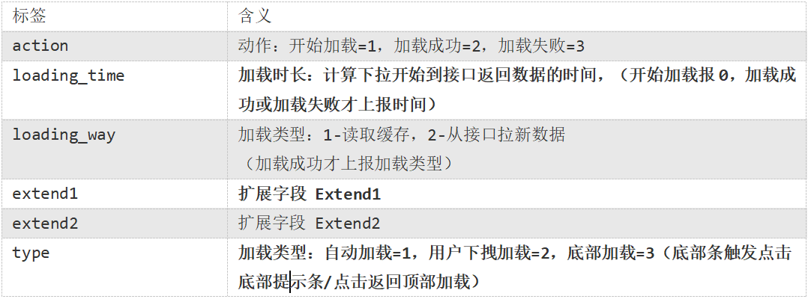

### 商品点击(display)

事件标签：display

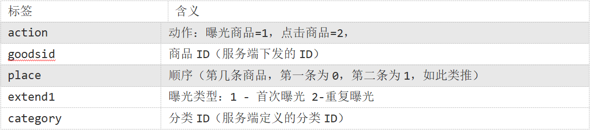

### 商品详情页(newsdetail)

事件标签：newsdetail

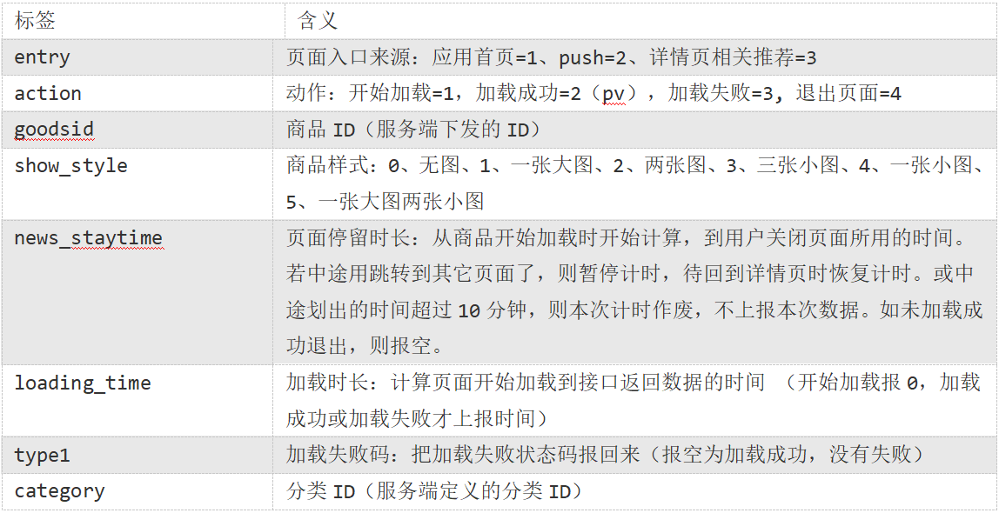

### 广告(ad)

事件名称：ad

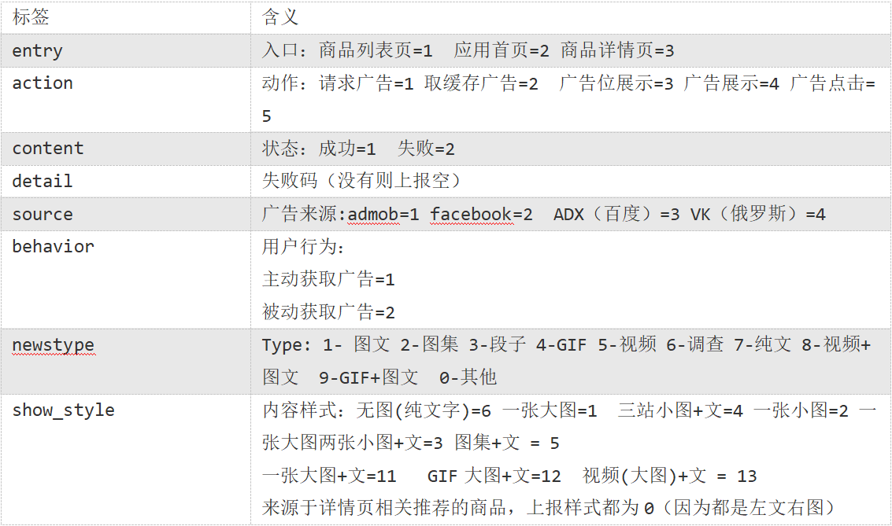

### 消息通知(notification)

事件标签：notification

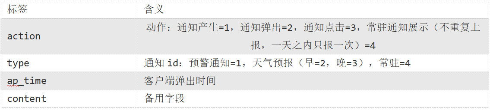

### 用户前台活跃(active_foreground)

事件标签: active_foreground

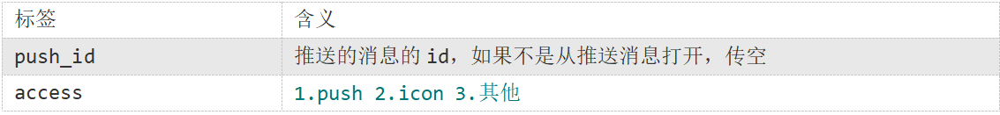

### 用户后台活跃(active_background)

事件标签: active_background

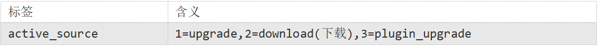

### 评论（comment）

描述：评论表

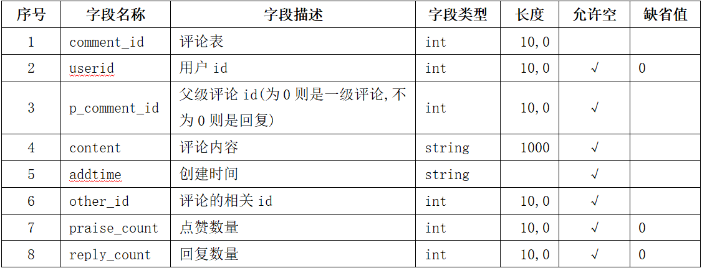

### 收藏（favorites）

描述：收藏

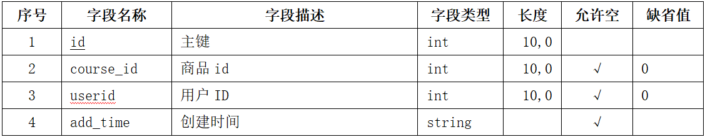

### 点赞（praise）

描述：所有的点赞表

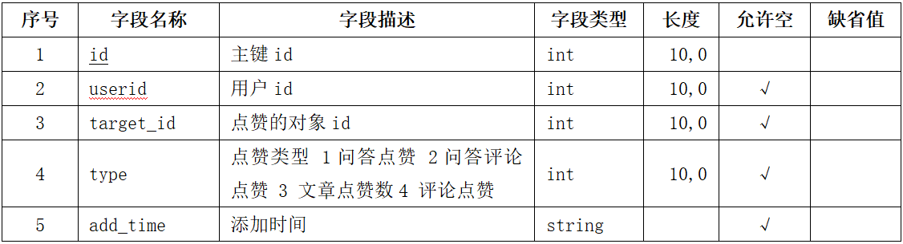

### 错误日志

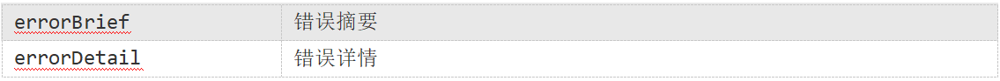

### 启动日志数据

事件标签: start  action=1可以算成前台活跃

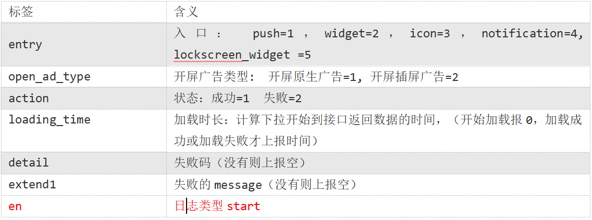

## 数仓搭建之ODS层

原始数据层，存放原始数据，直接加载原始日志、数据，数据保持原貌不做处理。

启动日志表 ods_start_log和事件日志表ods_event_log：

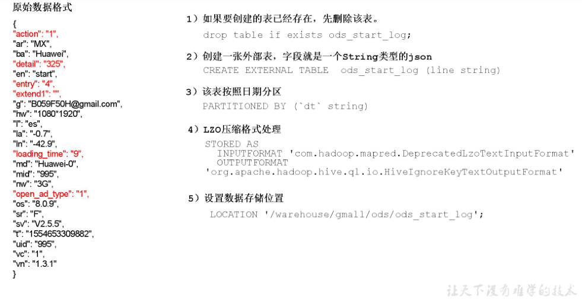

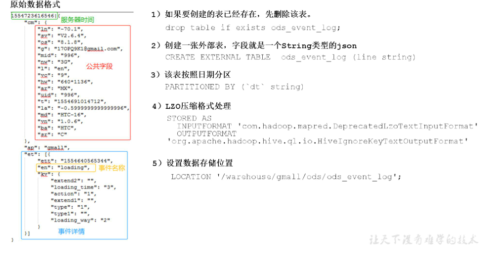

### 1.创建数据库gmall和两张hive表，并将数据从hdfs中load到hive表。

```
hive (default)>  create database gmall;

hive (default)> use gmall;

hive (gmall)> drop table if exists ods_start_log;
     CREATE EXTERNAL TABLE ods_start_log (`line` string)
             PARTITIONED BY (`dt` string)
             STORED AS
              INPUTFORMAT 'com.hadoop.mapred.DeprecatedLzoTextInputFormat'
              OUTPUTFORMAT 'org.apache.hadoop.hive.ql.io.HiveIgnoreKeyTextOutputFormat'
              LOCATION '/user/hive/warehouse/gmall/ods/ods_start_log';
 
hive (gmall)> load data inpath '/origin_data/gmall/log/topic_start/2019-08-19' into table gmall.ods_start_log partition(dt='2019-08-19');
 
hive (gmall)>  select * from ods_start_log limit 2;

#############################################################################################

hive (gmall)> drop table if exists ods_event_log;
         CREATE EXTERNAL TABLE ods_event_log(`line` string)
            PARTITIONED BY (`dt` string)
            STORED AS
              INPUTFORMAT 'com.hadoop.mapred.DeprecatedLzoTextInputFormat'
              OUTPUTFORMAT 'org.apache.hadoop.hive.ql.io.HiveIgnoreKeyTextOutputFormat'
              LOCATION '/user/hive/warehouse/gmall/ods/ods_event_log';
 
hive (gmall)> load data inpath '/origin_data/gmall/log/topic_event/2019-08-19' into table gmall.ods_event_log partition(dt='2019-08-19');
 
hive (gmall)> select * from ods_event_log limit 2;
```

### 2.ODS层加载数据脚本(ods_log.sh)

```
[root@Master code]# vim  ods_log.sh
################################################################################################

#!/bin/bash

# 定义变量方便修改
APP=gmall
hive=/root/apache-hive-1.2.1-bin/bin/hive

# 如果是输入的日期按照取输入日期；如果没输入日期取当前时间的前一天
if [ -n "$1" ] ;then
   do_date=$1
else
   do_date=`date -d "-1 day" +%F`
fi

echo "===日志日期为 $do_date==="
sql="
load data inpath '/origin_data/gmall/log/topic_start/$do_date' into table "$APP".ods_start_log partition(dt='$do_date');

load data inpath '/origin_data/gmall/log/topic_event/$do_date' into table "$APP".ods_event_log partition(dt='$do_date');
"

$hive -e "$sql"

################################################################################################

[root@Master code]# chmod 777  ods_log.sh  ##修改权限
[root@Master code]# ./ods_log.sh  2019-08-16
```

## 数仓搭建之DWD层

### 1.启动表

#### 1.1创建启动表并加载数据

```
############################################创建################################################
hive (gmall)> drop table if exists dwd_start_log;
       CREATE EXTERNAL TABLE dwd_start_log(
             `mid_id` string,
             `user_id` string, 
             `version_code` string, 
             `version_name` string, 
             `lang` string, 
             `source` string, 
             `os` string, 
             `area` string, 
             `model` string,
             `brand` string, 
             `sdk_version` string, 
             `gmail` string, 
             `height_width` string,  
             `app_time` string,
             `network` string, 
             `lng` string, 
             `lat` string, 
             `entry` string, 
             `open_ad_type` string, 
             `action` string, 
             `loading_time` string, 
             `detail` string, 
             `extend1` string
             )
             PARTITIONED BY (dt string)
             location '/user/hive/warehouse/gmall/dwd/dwd_start_log/';
            
############################################加载################################################

hive (gmall)> insert overwrite table dwd_start_log
             PARTITION (dt='2019-08-19')
             select 
                 get_json_object(line,'$.mid') mid_id,
                 get_json_object(line,'$.uid') user_id,
                 get_json_object(line,'$.vc') version_code,
                 get_json_object(line,'$.vn') version_name,
                 get_json_object(line,'$.l') lang,
                 get_json_object(line,'$.sr') source,
                 get_json_object(line,'$.os') os,
                 get_json_object(line,'$.ar') area,
                 get_json_object(line,'$.md') model,
                 get_json_object(line,'$.ba') brand,
                 get_json_object(line,'$.sv') sdk_version,
                 get_json_object(line,'$.g') gmail,
                 get_json_object(line,'$.hw') height_width,
                 get_json_object(line,'$.t') app_time,
                 get_json_object(line,'$.nw') network,
                 get_json_object(line,'$.ln') lng,
                 get_json_object(line,'$.la') lat,
                 get_json_object(line,'$.entry') entry,
                 get_json_object(line,'$.open_ad_type') open_ad_type,
                 get_json_object(line,'$.action') action,
                 get_json_object(line,'$.loading_time') loading_time,
                 get_json_object(line,'$.detail') detail,
                 get_json_object(line,'$.extend1') extend1
             from gmall.ods_start_log 
             where dt='2019-08-19';
             
################################################################################################

hive (gmall)> select * from dwd_start_log limit 100;
```

#### 1.2编写启动表日志加载脚本(dwd_start_log.sh)

```
#!/bin/bash

# 定义变量方便修改
APP=gmall
hive=/root/apache-hive-1.2.1-bin/bin/hive

# 如果是输入的日期按照取输入日期；如果没输入日期取当前时间的前一天
if [ -n "$1" ] ;then
	do_date=$1
else 
	do_date=`date -d "-1 day" +%F`  
fi 

sql="
set hive.exec.dynamic.partition.mode=nonstrict;
insert overwrite table "$APP".dwd_start_log
PARTITION (dt='$do_date')
select 
    get_json_object(line,'$.mid') mid_id,
    get_json_object(line,'$.uid') user_id,
    get_json_object(line,'$.vc') version_code,
    get_json_object(line,'$.vn') version_name,
    get_json_object(line,'$.l') lang,
    get_json_object(line,'$.sr') source,
    get_json_object(line,'$.os') os,
    get_json_object(line,'$.ar') area,
    get_json_object(line,'$.md') model,
    get_json_object(line,'$.ba') brand,
    get_json_object(line,'$.sv') sdk_version,
    get_json_object(line,'$.g') gmail,
    get_json_object(line,'$.hw') height_width,
    get_json_object(line,'$.t') app_time,
    get_json_object(line,'$.nw') network,
    get_json_object(line,'$.ln') lng,
    get_json_object(line,'$.la') lat,
    get_json_object(line,'$.entry') entry,
    get_json_object(line,'$.open_ad_type') open_ad_type,
    get_json_object(line,'$.action') action,
    get_json_object(line,'$.loading_time') loading_time,
    get_json_object(line,'$.detail') detail,
    get_json_object(line,'$.extend1') extend1
from "$APP".ods_start_log 
where dt='$do_date';
"

$hive -e "$sql"

################################################################################################

[root@Master code]# vim dwd_start_log.sh 

[root@Master code]# chmod 777 dwd_start_log.sh 
 
[root@Master code]# ./dwd_start_log.sh  2019-08-16
```

### 2.事件表

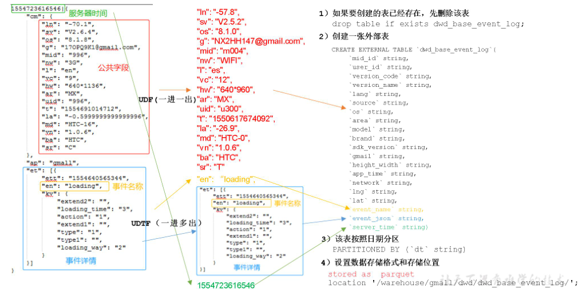

2.1创建基础明细表

```
drop table if exists dwd_base_event_log;
CREATE EXTERNAL TABLE dwd_base_event_log(
`mid_id` string,
`user_id` string, 
`version_code` string, 
`version_name` string, 
`lang` string, 
`source` string, 
`os` string, 
`area` string, 
`model` string,
`brand` string, 
`sdk_version` string, 
`gmail` string, 
`height_width` string, 
`app_time` string, 
`network` string, 
`lng` string, 
`lat` string, 
`event_name` string, 
`event_json` string, 
`server_time` string)
PARTITIONED BY (`dt` string)
stored as parquet
location '/user/hive/warehouse/gmall/dwd/dwd_base_event_log/';
```

2.2自定义UDF(解析公共字段)

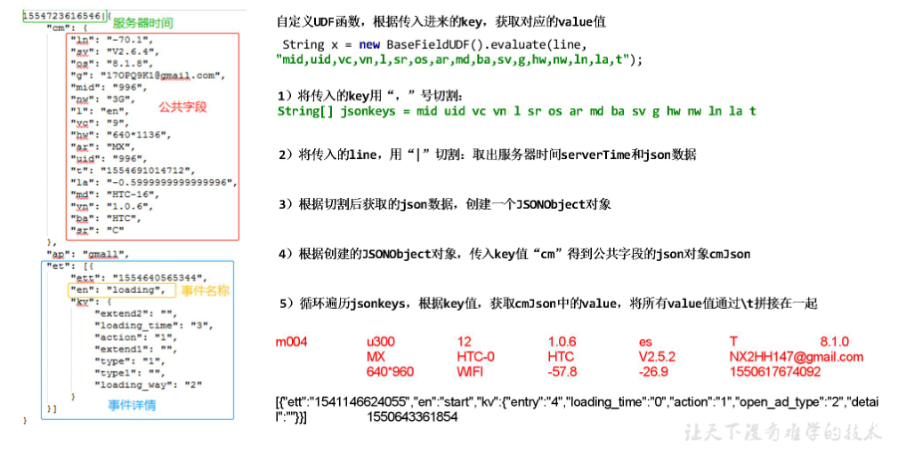

    package com.lx.udf;
    
    import org.apache.commons.lang.StringUtils;
    import org.apache.hadoop.hive.ql.exec.UDF;
    import org.json.JSONException;
    import org.json.JSONObject;
    
    public class BaseFieldUDF extends UDF {
    
        public String evaluate(String line, String jsonkeysString){
    
            // 0
            StringBuilder sb = new StringBuilder();
    
            // 1 jsonkeysString 切割
            String[] jsonkeys = jsonkeysString.split(",");
    
            // 2 line  服务器时间| json
            if (line== null){
                return "";
            }
            
            String[] logContents = line.split("\\|");
    
            if (logContents.length != 2 || StringUtils.isBlank(logContents[1])){
                return "";
            }
    
            // 3 创建json对象
            try {
                JSONObject jsonObject = new JSONObject(logContents[1]);
    
                JSONObject cm = jsonObject.getJSONObject("cm");
    
                for (int i = 0; i < jsonkeys.length; i++) {
                    String jsonkey = jsonkeys[i];
    
                    if(cm.has(jsonkey)){
                        sb.append(cm.getString(jsonkey)).append("\t");
                    }else {
                        sb.append("\t");
                    }
                }
    
                sb.append(jsonObject.getString("et")).append("\t");
                sb.append(logContents[0]).append("\t");
    
            } catch (JSONException e) {
                e.printStackTrace();
            }
    
            return sb.toString();
        }
    
        public static void main(String[] args) {
    
            String line = "1541217850324|{\"cm\":{\"mid\":\"m7856\",\"uid\":\"u8739\",\"ln\":\"-74.8\",\"sv\":\"V2.2.2\",\"os\":\"8.1.3\",\"g\":\"P7XC9126@gmail.com\",\"nw\":\"3G\",\"l\":\"es\",\"vc\":\"6\",\"hw\":\"640*960\",\"ar\":\"MX\",\"t\":\"1541204134250\",\"la\":\"-31.7\",\"md\":\"huawei-17\",\"vn\":\"1.1.2\",\"sr\":\"O\",\"ba\":\"Huawei\"},\"ap\":\"weather\",\"et\":[{\"ett\":\"1541146624055\",\"en\":\"display\",\"kv\":{\"goodsid\":\"n4195\",\"copyright\":\"ESPN\",\"content_provider\":\"CNN\",\"extend2\":\"5\",\"action\":\"2\",\"extend1\":\"2\",\"place\":\"3\",\"showtype\":\"2\",\"category\":\"72\",\"newstype\":\"5\"}},{\"ett\":\"1541213331817\",\"en\":\"loading\",\"kv\":{\"extend2\":\"\",\"loading_time\":\"15\",\"action\":\"3\",\"extend1\":\"\",\"type1\":\"\",\"type\":\"3\",\"loading_way\":\"1\"}},{\"ett\":\"1541126195645\",\"en\":\"ad\",\"kv\":{\"entry\":\"3\",\"show_style\":\"0\",\"action\":\"2\",\"detail\":\"325\",\"source\":\"4\",\"behavior\":\"2\",\"content\":\"1\",\"newstype\":\"5\"}},{\"ett\":\"1541202678812\",\"en\":\"notification\",\"kv\":{\"ap_time\":\"1541184614380\",\"action\":\"3\",\"type\":\"4\",\"content\":\"\"}},{\"ett\":\"1541194686688\",\"en\":\"active_background\",\"kv\":{\"active_source\":\"3\"}}]}";
            String x = new BaseFieldUDF().evaluate(line, "mid,uid,vc,vn,l,sr,os,ar,md,ba,sv,g,hw,nw,ln,la,t");
            System.out.println(x);
        }
    
    }

2.3自定义UDTF(解析具体 事件字段)

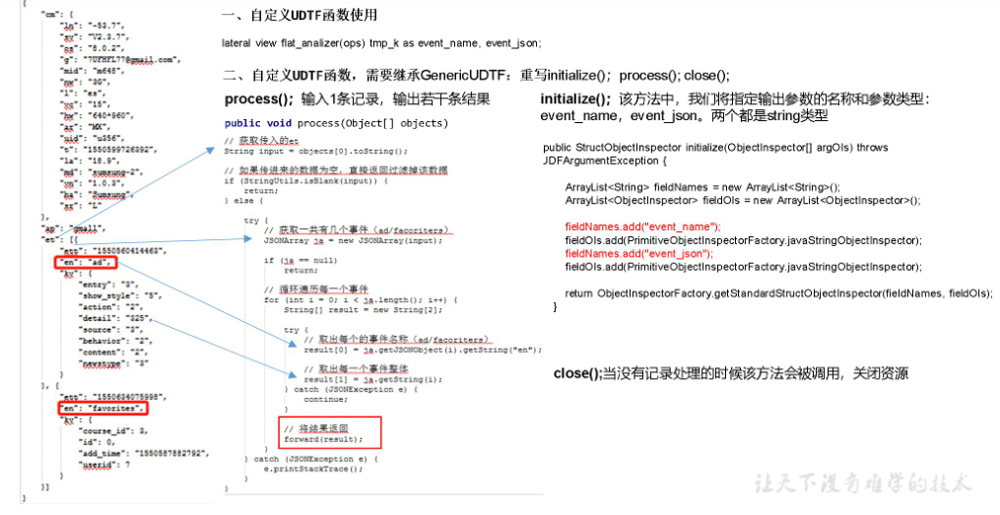

    package com.lx.udtf;
    
    import org.apache.commons.lang.StringUtils;
    import org.apache.hadoop.hive.ql.exec.UDFArgumentException;
    import org.apache.hadoop.hive.ql.metadata.HiveException;
    import org.apache.hadoop.hive.ql.udf.generic.GenericUDTF;
    import org.apache.hadoop.hive.serde2.objectinspector.ObjectInspector;
    import org.apache.hadoop.hive.serde2.objectinspector.ObjectInspectorFactory;
    import org.apache.hadoop.hive.serde2.objectinspector.StructObjectInspector;
    import org.apache.hadoop.hive.serde2.objectinspector.primitive.PrimitiveObjectInspectorFactory;
    import org.json.JSONArray;
    import org.json.JSONException;
    
    import java.util.ArrayList;
    import java.util.List;
    
    public class EventJsonUDTF extends GenericUDTF{
    
        @Deprecated
        public StructObjectInspector initialize(ObjectInspector[] argOIs) throws UDFArgumentException {
    
            List<String> fieldNames = new ArrayList<>();
            List<ObjectInspector> fieldTypes = new ArrayList<>();
    
            fieldNames.add("event_name");
            fieldTypes.add(PrimitiveObjectInspectorFactory.javaStringObjectInspector);
    
            fieldNames.add("event_json");
            fieldTypes.add(PrimitiveObjectInspectorFactory.javaStringObjectInspector);
    
            return ObjectInspectorFactory.getStandardStructObjectInspector(fieldNames,fieldTypes);
        }
    
        @Override
        public void process(Object[] objects) throws HiveException {
    
            // 1 获取数据
            String input = objects[0].toString();
    
            // 2 校验
            if (StringUtils.isBlank(input)){
                return;
            }else {
                try {
                    
                    //取出一共有几个字段（ad/favorites）
                    JSONArray jsonArray = new JSONArray(input);
                    
                    if (jsonArray == null){
                        return;
                    }
    
                    for (int i = 0; i < jsonArray.length(); i++) {
    
                        String[] results = new String[2];
    
                        try {
                            // 获取事件名称
                            results[0]= jsonArray.getJSONObject(i).getString("en"); //event_name
    
                            results[1] =jsonArray.getString(i);  //event_json
                        } catch (JSONException e) {
                            e.printStackTrace();
                            continue;
                        }
    
                        // 把结果写出去
                        forward(results);
                    }
    
                } catch (JSONException e) {
                    e.printStackTrace();
                }
            }
    
        }
    
        @Override
        public void close() throws HiveException {
    
        }
    }
2.4maven打包出现的问题

```
[ERROR] Failed to execute goal on project hivefunction: Could not resolve dependencies for project com.lx:hivefunction:jar:1.0-SNAPSHOT: Could not find artifact org.pentaho:pentaho-aggdesigner-algorithm:jar:5.1.5-jhyde in nexus-aliyun  

原因：引用jar包找不到 

解决方法：从如下网址下载jar，上传到maven本地库路径，
D:\apache-maven-3.6.0\repository\org\pentaho\pentaho-aggdesigner-algorithm\5.1.5-jhyde

```

2.5在hive中声明自定义函数

```
hive (gmall)>  

add  jar  /root/code/hivefunction-1.0-SNAPSHOT.jar;

hive (gmall)> 
create temporary function base_analizer as 'com.lx.udf.BaseFieldUDF';

create temporary function flat_analizer as 'com.lx.udtf.EventJsonUDTF';
```

2.6解析事件日志基础明细表

```
hive (gmall)> 
set hive.exec.dynamic.partition.mode=nonstrict;

insert overwrite table dwd_base_event_log 
PARTITION (dt='2019-08-19')
select
mid_id,
user_id,
version_code,
version_name,
lang,
source,
os,
area,
model,
brand,
sdk_version,
gmail,
height_width,
app_time,
network,
lng,
lat,
event_name,
event_json,
server_time
from
(
select
split(base_analizer(line,'mid,uid,vc,vn,l,sr,os,ar,md,ba,sv,g,hw,t,nw,ln,la'),'\t')[0]   as mid_id,
split(base_analizer(line,'mid,uid,vc,vn,l,sr,os,ar,md,ba,sv,g,hw,t,nw,ln,la'),'\t')[1]   as user_id,
split(base_analizer(line,'mid,uid,vc,vn,l,sr,os,ar,md,ba,sv,g,hw,t,nw,ln,la'),'\t')[2]   as version_code,
split(base_analizer(line,'mid,uid,vc,vn,l,sr,os,ar,md,ba,sv,g,hw,t,nw,ln,la'),'\t')[3]   as version_name,
split(base_analizer(line,'mid,uid,vc,vn,l,sr,os,ar,md,ba,sv,g,hw,t,nw,ln,la'),'\t')[4]   as lang,
split(base_analizer(line,'mid,uid,vc,vn,l,sr,os,ar,md,ba,sv,g,hw,t,nw,ln,la'),'\t')[5]   as source,
split(base_analizer(line,'mid,uid,vc,vn,l,sr,os,ar,md,ba,sv,g,hw,t,nw,ln,la'),'\t')[6]   as os,
split(base_analizer(line,'mid,uid,vc,vn,l,sr,os,ar,md,ba,sv,g,hw,t,nw,ln,la'),'\t')[7]   as area,
split(base_analizer(line,'mid,uid,vc,vn,l,sr,os,ar,md,ba,sv,g,hw,t,nw,ln,la'),'\t')[8]   as model,
split(base_analizer(line,'mid,uid,vc,vn,l,sr,os,ar,md,ba,sv,g,hw,t,nw,ln,la'),'\t')[9]   as brand,
split(base_analizer(line,'mid,uid,vc,vn,l,sr,os,ar,md,ba,sv,g,hw,t,nw,ln,la'),'\t')[10]   as sdk_version,
split(base_analizer(line,'mid,uid,vc,vn,l,sr,os,ar,md,ba,sv,g,hw,t,nw,ln,la'),'\t')[11]  as gmail,
split(base_analizer(line,'mid,uid,vc,vn,l,sr,os,ar,md,ba,sv,g,hw,t,nw,ln,la'),'\t')[12]  as height_width,
split(base_analizer(line,'mid,uid,vc,vn,l,sr,os,ar,md,ba,sv,g,hw,t,nw,ln,la'),'\t')[13]  as app_time,
split(base_analizer(line,'mid,uid,vc,vn,l,sr,os,ar,md,ba,sv,g,hw,t,nw,ln,la'),'\t')[14]  as network,
split(base_analizer(line,'mid,uid,vc,vn,l,sr,os,ar,md,ba,sv,g,hw,t,nw,ln,la'),'\t')[15]  as lng,
split(base_analizer(line,'mid,uid,vc,vn,l,sr,os,ar,md,ba,sv,g,hw,t,nw,ln,la'),'\t')[16]  as lat,
split(base_analizer(line,'mid,uid,vc,vn,l,sr,os,ar,md,ba,sv,g,hw,t,nw,ln,la'),'\t')[17]  as ops,
split(base_analizer(line,'mid,uid,vc,vn,l,sr,os,ar,md,ba,sv,g,hw,t,nw,ln,la'),'\t')[18]  as server_time
from ods_event_log where dt='2019-08-19'  and base_analizer(line,'mid,uid,vc,vn,l,sr,os,ar,md,ba,sv,g,hw,t,nw,ln,la')<>'' 
) sdk_log lateral view flat_analizer(ops) tmp_k as event_name, event_json;
```

2.7测试

```
hive (gmall)> select * from dwd_base_event_log limit 2;
```

#### 2.8DWD层数据解析脚本(dwd_base_log.sh)

	#!/bin/bash
	
	# 定义变量方便修改
	APP=gmall
	hive=/root/apache-hive-1.2.1-bin/bin/hive
	
	# 如果是输入的日期按照取输入日期；如果没输入日期取当前时间的前一天
	if [ -n "$1" ] ;then
		do_date=$1
	else 
		do_date=`date -d "-1 day" +%F`  
	fi 
	
	sql="
		add jar  /root/code/hivefunction-1.0-SNAPSHOT.jar;
	
		create temporary function base_analizer as 'com.lx.udf.BaseFieldUDF';
		create temporary function flat_analizer as 'com.lx.udtf.EventJsonUDTF';
	
	 	set hive.exec.dynamic.partition.mode=nonstrict;
	
		insert overwrite table "$APP".dwd_base_event_log 
		PARTITION (dt='$do_date')
		select
		mid_id,
		user_id,
		version_code,
		version_name,
		lang,
		source ,
		os ,
		area ,
		model ,
		brand ,
		sdk_version ,
		gmail ,
		height_width ,
		network ,
		lng ,
		lat ,
		app_time ,
		event_name , 
		event_json , 
		server_time  
		from
		(
		select
		split(base_analizer(line,'mid,uid,vc,vn,l,sr,os,ar,md,ba,sv,g,hw,t,nw,ln,la'),'\t')[0]   as mid_id,
		split(base_analizer(line,'mid,uid,vc,vn,l,sr,os,ar,md,ba,sv,g,hw,t,nw,ln,la'),'\t')[1]   as user_id,
		split(base_analizer(line,'mid,uid,vc,vn,l,sr,os,ar,md,ba,sv,g,hw,t,nw,ln,la'),'\t')[2]   as version_code,
		split(base_analizer(line,'mid,uid,vc,vn,l,sr,os,ar,md,ba,sv,g,hw,t,nw,ln,la'),'\t')[3]   as version_name,
		split(base_analizer(line,'mid,uid,vc,vn,l,sr,os,ar,md,ba,sv,g,hw,t,nw,ln,la'),'\t')[4]   as lang,
		split(base_analizer(line,'mid,uid,vc,vn,l,sr,os,ar,md,ba,sv,g,hw,t,nw,ln,la'),'\t')[5]   as source,
		split(base_analizer(line,'mid,uid,vc,vn,l,sr,os,ar,md,ba,sv,g,hw,t,nw,ln,la'),'\t')[6]   as os,
		split(base_analizer(line,'mid,uid,vc,vn,l,sr,os,ar,md,ba,sv,g,hw,t,nw,ln,la'),'\t')[7]   as area,
		split(base_analizer(line,'mid,uid,vc,vn,l,sr,os,ar,md,ba,sv,g,hw,t,nw,ln,la'),'\t')[8]   as model,
		split(base_analizer(line,'mid,uid,vc,vn,l,sr,os,ar,md,ba,sv,g,hw,t,nw,ln,la'),'\t')[9]   as brand,
		split(base_analizer(line,'mid,uid,vc,vn,l,sr,os,ar,md,ba,sv,g,hw,t,nw,ln,la'),'\t')[10]   as sdk_version,
		split(base_analizer(line,'mid,uid,vc,vn,l,sr,os,ar,md,ba,sv,g,hw,t,nw,ln,la'),'\t')[11]  as gmail,
		split(base_analizer(line,'mid,uid,vc,vn,l,sr,os,ar,md,ba,sv,g,hw,t,nw,ln,la'),'\t')[12]  as height_width,
		split(base_analizer(line,'mid,uid,vc,vn,l,sr,os,ar,md,ba,sv,g,hw,t,nw,ln,la'),'\t')[13]  as app_time,
		split(base_analizer(line,'mid,uid,vc,vn,l,sr,os,ar,md,ba,sv,g,hw,t,nw,ln,la'),'\t')[14]  as network,
		split(base_analizer(line,'mid,uid,vc,vn,l,sr,os,ar,md,ba,sv,g,hw,t,nw,ln,la'),'\t')[15]  as lng,
		split(base_analizer(line,'mid,uid,vc,vn,l,sr,os,ar,md,ba,sv,g,hw,t,nw,ln,la'),'\t')[16]  as lat,
		split(base_analizer(line,'mid,uid,vc,vn,l,sr,os,ar,md,ba,sv,g,hw,t,nw,ln,la'),'\t')[17]  as ops,
		split(base_analizer(line,'mid,uid,vc,vn,l,sr,os,ar,md,ba,sv,g,hw,t,nw,ln,la'),'\t')[18]  as server_time
		from "$APP".ods_event_log where dt='$do_date'  and base_analizer(line,'mid,uid,vc,vn,l,sr,os,ar,md,ba,sv,g,hw,t,nw,ln,la')<>'' 
		) sdk_log lateral view flat_analizer(ops) tmp_k as event_name, event_json;
	"
	
	$hive -e "$sql"
	
	dwd_base_log.sh 2019-08-16
	
	############################################测试脚本############################################
	[root@Master code]# ./dwd_base_log.sh 2019-08-16
### 3.商品点击表

3.1建表语句

```
hive (gmall)> 
drop table if exists dwd_display_log;
CREATE EXTERNAL TABLE dwd_display_log(
`mid_id` string,
`user_id` string,
`version_code` string,
`version_name` string,
`lang` string,
`source` string,
`os` string,
`area` string,
`model` string,
`brand` string,
`sdk_version` string,
`gmail` string,
`height_width` string,
`app_time` string,
`network` string,
`lng` string,
`lat` string,
`action` string,
`goodsid` string,
`place` string,
`extend1` string,
`category` string,
`server_time` string
)
PARTITIONED BY (dt string)
location '/user/hive/warehouse/gmall/dwd/dwd_display_log/';
```

3.2导入数据

```
hive (gmall)> 
set hive.exec.dynamic.partition.mode=nonstrict;

insert overwrite table dwd_display_log
PARTITION (dt='2019-08-19')
select 
mid_id,
user_id,
version_code,
version_name,
lang,
source,
os,
area,
model,
brand,
sdk_version,
gmail,
height_width,
app_time,
network,
lng,
lat,
get_json_object(event_json,'$.kv.action') action,
get_json_object(event_json,'$.kv.goodsid') goodsid,
get_json_object(event_json,'$.kv.place') place,
get_json_object(event_json,'$.kv.extend1') extend1,
get_json_object(event_json,'$.kv.category') category,
server_time
from dwd_base_event_log 
where dt='2019-08-19' and event_name='display';

################################################################################################
hive (gmall)> select * from dwd_display_log limit 100;
```

### 4.商品详情页表

4.1建表语句

```
hive (gmall)> 
drop table if exists dwd_newsdetail_log;
CREATE EXTERNAL TABLE dwd_newsdetail_log(
`mid_id` string,
`user_id` string, 
`version_code` string, 
`version_name` string, 
`lang` string, 
`source` string, 
`os` string, 
`area` string, 
`model` string,
`brand` string, 
`sdk_version` string, 
`gmail` string, 
`height_width` string, 
`app_time` string,  
`network` string, 
`lng` string, 
`lat` string, 
`entry` string,
`action` string,
`goodsid` string,
`showtype` string,
`news_staytime` string,
`loading_time` string,
`type1` string,
`category` string,
`server_time` string)
PARTITIONED BY (dt string)
location '/user/hive/warehouse/gmall/dwd/dwd_newsdetail_log/';
```

4.2导入数据

```
hive (gmall)> 
set hive.exec.dynamic.partition.mode=nonstrict;

insert overwrite table dwd_newsdetail_log
PARTITION (dt='2019-08-19')
select 
mid_id,
user_id,
version_code,
version_name,
lang,
source,
os,
area,
model,
brand,
sdk_version,
gmail,
height_width,
app_time,
network,
lng,
lat,
get_json_object(event_json,'$.kv.entry') entry,
get_json_object(event_json,'$.kv.action') action,
get_json_object(event_json,'$.kv.goodsid') goodsid,
get_json_object(event_json,'$.kv.showtype') showtype,
get_json_object(event_json,'$.kv.news_staytime') news_staytime,
get_json_object(event_json,'$.kv.loading_time') loading_time,
get_json_object(event_json,'$.kv.type1') type1,
get_json_object(event_json,'$.kv.category') category,
server_time
from dwd_base_event_log
where dt='2019-08-19' and event_name='newsdetail';

##############################################测试##############################################
hive (gmall)> select * from dwd_newsdetail_log limit 2;
```

### 5.商品列表页表

5.1建表语句

```
hive (gmall)> 
drop table if exists dwd_loading_log;
CREATE EXTERNAL TABLE dwd_loading_log(
`mid_id` string,
`user_id` string, 
`version_code` string, 
`version_name` string, 
`lang` string, 
`source` string, 
`os` string, 
`area` string, 
`model` string,
`brand` string, 
`sdk_version` string, 
`gmail` string,
`height_width` string,  
`app_time` string,
`network` string, 
`lng` string, 
`lat` string, 
`action` string,
`loading_time` string,
`loading_way` string,
`extend1` string,
`extend2` string,
`type` string,
`type1` string,
`server_time` string)
PARTITIONED BY (dt string)
location '/user/hive/warehouse/gmall/dwd/dwd_loading_log/';
```

5.2导入数据

```
hive (gmall)> 
set hive.exec.dynamic.partition.mode=nonstrict;

insert overwrite table dwd_loading_log
PARTITION (dt='2019-08-19')
select 
mid_id,
user_id,
version_code,
version_name,
lang,
source,
os,
area,
model,
brand,
sdk_version,
gmail,
height_width,
app_time,
network,
lng,
lat,
get_json_object(event_json,'$.kv.action') action,
get_json_object(event_json,'$.kv.loading_time') loading_time,
get_json_object(event_json,'$.kv.loading_way') loading_way,
get_json_object(event_json,'$.kv.extend1') extend1,
get_json_object(event_json,'$.kv.extend2') extend2,
get_json_object(event_json,'$.kv.type') type,
get_json_object(event_json,'$.kv.type1') type1,
server_time
from dwd_base_event_log
where dt='2019-08-19' and event_name='loading';

############################################测试################################################
hive (gmall)> select * from dwd_loading_log limit 2;
```

### 6.广告表

6.1建表语句

```
hive (gmall)> 
drop table if exists dwd_ad_log;
CREATE EXTERNAL TABLE dwd_ad_log(
`mid_id` string,
`user_id` string, 
`version_code` string, 
`version_name` string, 
`lang` string, 
`source` string, 
`os` string, 
`area` string, 
`model` string,
`brand` string, 
`sdk_version` string, 
`gmail` string, 
`height_width` string,  
`app_time` string,
`network` string, 
`lng` string, 
`lat` string, 
`entry` string,
`action` string,
`content` string,
`detail` string,
`ad_source` string,
`behavior` string,
`newstype` string,
`show_style` string,
`server_time` string)
PARTITIONED BY (dt string)
location '/user/hive/warehouse/gmall/dwd/dwd_ad_log/';
```

6.2导入数据

```
hive (gmall)> 
set hive.exec.dynamic.partition.mode=nonstrict;

insert overwrite table dwd_ad_log
PARTITION (dt='2019-08-19')
select 
mid_id,
user_id,
version_code,
version_name,
lang,
source,
os,
area,
model,
brand,
sdk_version,
gmail,
height_width,
app_time,
network,
lng,
lat,
get_json_object(event_json,'$.kv.entry') entry,
get_json_object(event_json,'$.kv.action') action,
get_json_object(event_json,'$.kv.content') content,
get_json_object(event_json,'$.kv.detail') detail,
get_json_object(event_json,'$.kv.source') ad_source,
get_json_object(event_json,'$.kv.behavior') behavior,
get_json_object(event_json,'$.kv.newstype') newstype,
get_json_object(event_json,'$.kv.show_style') show_style,
server_time
from dwd_base_event_log 
where dt='2019-08-19' and event_name='ad';

#############################################测试###############################################

hive (gmall)> select * from dwd_ad_log limit 2;
```

### 7.消息通知表

7.1建表语句

```
hive (gmall)> 
drop table if exists dwd_notification_log;
CREATE EXTERNAL TABLE dwd_notification_log(
`mid_id` string,
`user_id` string, 
`version_code` string, 
`version_name` string, 
`lang` string,
`source` string, 
`os` string, 
`area` string, 
`model` string,
`brand` string, 
`sdk_version` string, 
`gmail` string, 
`height_width` string,  
`app_time` string,
`network` string, 
`lng` string, 
`lat` string, 
`action` string,
`noti_type` string,
`ap_time` string,
`content` string,
`server_time` string
)
PARTITIONED BY (dt string)
location '/user/hive/warehouse/gmall/dwd/dwd_notification_log/';

```

7.2导入数据

```
hive (gmall)> 
set hive.exec.dynamic.partition.mode=nonstrict;

insert overwrite table dwd_notification_log
PARTITION (dt='2019-08-19')
select 
mid_id,
user_id,
version_code,
version_name,
lang,
source,
os,
area,
model,
brand,
sdk_version,
gmail,
height_width,
app_time,
network,
lng,
lat,
get_json_object(event_json,'$.kv.action') action,
get_json_object(event_json,'$.kv.noti_type') noti_type,
get_json_object(event_json,'$.kv.ap_time') ap_time,
get_json_object(event_json,'$.kv.content') content,
server_time
from dwd_base_event_log
where dt='2019-08-19' and event_name='notification';

#######################################测试#####################################################
hive (gmall)> select * from dwd_notification_log limit 2;
```

### 8.用户前台活跃表

8.1建表语句

```
hive (gmall)> 
drop table if exists dwd_active_foreground_log;
CREATE EXTERNAL TABLE dwd_active_foreground_log(
`mid_id` string,
`user_id` string,
`version_code` string,
`version_name` string,
`lang` string,
`source` string,
`os` string,
`area` string,
`model` string,
`brand` string,
`sdk_version` string,
`gmail` string,
`height_width` string,
`app_time` string,
`network` string,
`lng` string,
`lat` string,
`push_id` string,
`access` string,
`server_time` string)
PARTITIONED BY (dt string)
location '/user/hive/warehouse/gmall/dwd/dwd_foreground_log/';
```

8.2导入数据

```
hive (gmall)> 
set hive.exec.dynamic.partition.mode=nonstrict;

insert overwrite table dwd_active_foreground_log
PARTITION (dt='2019-08-19')
select 
mid_id,
user_id,
version_code,
version_name,
lang,
source,
os,
area,
model,
brand,
sdk_version,
gmail,
height_width,
app_time,
network,
lng,
lat,
get_json_object(event_json,'$.kv.push_id') push_id,
get_json_object(event_json,'$.kv.access') access,
server_time
from dwd_base_event_log
where dt='2019-08-19' and event_name='active_foreground';

##############################################测试##############################################
hive (gmall)> select * from dwd_active_foreground_log limit 2;
```

### 9.用户后台活跃表

9.1建表语句

```
hive (gmall)> 
drop table if exists dwd_active_background_log;
CREATE EXTERNAL TABLE dwd_active_background_log(
`mid_id` string,
`user_id` string,
`version_code` string,
`version_name` string,
`lang` string,
`source` string,
`os` string,
`area` string,
`model` string,
`brand` string,
`sdk_version` string,
`gmail` string,
 `height_width` string,
`app_time` string,
`network` string,
`lng` string,
`lat` string,
`active_source` string,
`server_time` string
)
PARTITIONED BY (dt string)
location '/user/hive/warehouse/gmall/dwd/dwd_background_log/';
```

9.2导入数据

```
hive (gmall)> 
set hive.exec.dynamic.partition.mode=nonstrict;

insert overwrite table dwd_active_background_log
PARTITION (dt='2019-08-19')
select 
mid_id,
user_id,
version_code,
version_name,
lang,
source,
os,
area,
model,
brand,
sdk_version,
gmail,
height_width,
app_time,
network,
lng,
lat,
get_json_object(event_json,'$.kv.active_source') active_source,
server_time
from dwd_base_event_log
where dt='2019-08-19' and event_name='active_background';

#################################测试####################################################
hive (gmall)> select * from dwd_active_background_log limit 2;
```

### 10.评论表

10.1建表语句

```
hive (gmall)> 
drop table if exists dwd_comment_log;
CREATE EXTERNAL TABLE dwd_comment_log(
`mid_id` string,
`user_id` string,
`version_code` string,
`version_name` string,
`lang` string,
`source` string,
`os` string,
`area` string,
`model` string,
`brand` string,
`sdk_version` string,
`gmail` string,
`height_width` string,
`app_time` string,
`network` string,
`lng` string,
`lat` string,
`comment_id` int,
`userid` int,
`p_comment_id` int, 
`content` string,
`addtime` string,
`other_id` int,
`praise_count` int,
`reply_count` int,
`server_time` string
)
PARTITIONED BY (dt string)
location '/user/hive/warehouse/gmall/dwd/dwd_comment_log/';
```

10.2导入数据

```
hive (gmall)> 
set hive.exec.dynamic.partition.mode=nonstrict;

insert overwrite table dwd_comment_log
PARTITION (dt='2019-08-19')
select 
mid_id,
user_id,
version_code,
version_name,
lang,
source,
os,
area,
model,
brand,
sdk_version,
gmail,
height_width,
app_time,
network,
lng,
lat,
get_json_object(event_json,'$.kv.comment_id') comment_id,
get_json_object(event_json,'$.kv.userid') userid,
get_json_object(event_json,'$.kv.p_comment_id') p_comment_id,
get_json_object(event_json,'$.kv.content') content,
get_json_object(event_json,'$.kv.addtime') addtime,
get_json_object(event_json,'$.kv.other_id') other_id,
get_json_object(event_json,'$.kv.praise_count') praise_count,
get_json_object(event_json,'$.kv.reply_count') reply_count,
server_time
from dwd_base_event_log
where dt='2019-08-19' and event_name='comment';

##################################测试##########################################################
hive (gmall)> select * from dwd_comment_log limit 2;
```

### 11.收藏表

11.1建表语句

```
hive (gmall)> 
drop table if exists dwd_favorites_log;
CREATE EXTERNAL TABLE dwd_favorites_log(
`mid_id` string,
`user_id` string, 
`version_code` string, 
`version_name` string, 
`lang` string, 
`source` string, 
`os` string, 
`area` string, 
`model` string,
`brand` string, 
`sdk_version` string, 
`gmail` string, 
`height_width` string,  
`app_time` string,
`network` string, 
`lng` string, 
`lat` string, 
`id` int, 
`course_id` int, 
`userid` int,
`add_time` string,
`server_time` string
)
PARTITIONED BY (dt string)
location '/user/hive/warehouse/gmall/dwd/dwd_favorites_log/';
```

11.2导入数据

```
hive (gmall)> 
set hive.exec.dynamic.partition.mode=nonstrict;

insert overwrite table dwd_favorites_log
PARTITION (dt='2019-08-19')
select 
mid_id,
user_id,
version_code,
version_name,
lang,
source,
os,
area,
model,
brand,
sdk_version,
gmail,
height_width,
app_time,
network,
lng,
lat,
get_json_object(event_json,'$.kv.id') id,
get_json_object(event_json,'$.kv.course_id') course_id,
get_json_object(event_json,'$.kv.userid') userid,
get_json_object(event_json,'$.kv.add_time') add_time,
server_time
from dwd_base_event_log 
where dt='2019-08-19' and event_name='favorites';

#############################测试###############################################################
hive (gmall)> select * from dwd_favorites_log limit 2;
```

### 12.点赞表

12.1建表语句

```
hive (gmall)> 
drop table if exists dwd_praise_log;
CREATE EXTERNAL TABLE dwd_praise_log(
`mid_id` string,
`user_id` string, 
`version_code` string, 
`version_name` string, 
`lang` string, 
`source` string, 
`os` string, 
`area` string, 
`model` string,
`brand` string, 
`sdk_version` string, 
`gmail` string, 
`height_width` string,  
`app_time` string,
`network` string, 
`lng` string, 
`lat` string, 
`id` string, 
`userid` string, 
`target_id` string,
`type` string,
`add_time` string,
`server_time` string
)
PARTITIONED BY (dt string)
location '/user/hive/warehouse/gmall/dwd/dwd_praise_log/';
```

12.2导入数据

```
hive (gmall)> 
set hive.exec.dynamic.partition.mode=nonstrict;

insert overwrite table dwd_praise_log
PARTITION (dt='2019-08-19')
select 
mid_id,
user_id,
version_code,
version_name,
lang,
source,
os,
area,
model,
brand,
sdk_version,
gmail,
height_width,
app_time,
network,
lng,
lat,
get_json_object(event_json,'$.kv.id') id,
get_json_object(event_json,'$.kv.userid') userid,
get_json_object(event_json,'$.kv.target_id') target_id,
get_json_object(event_json,'$.kv.type') type,
get_json_object(event_json,'$.kv.add_time') add_time,
server_time
from dwd_base_event_log
where dt='2019-08-19' and event_name='praise';

##############################测试##############################################################
hive (gmall)> select * from dwd_praise_log limit 2;
```

### 13.错误日志表

13.1建表语句

```
hive (gmall)> 
drop table if exists dwd_error_log;
CREATE EXTERNAL TABLE dwd_error_log(
`mid_id` string,
`user_id` string, 
`version_code` string, 
`version_name` string, 
`lang` string, 
`source` string, 
`os` string, 
`area` string, 
`model` string,
`brand` string, 
`sdk_version` string, 
`gmail` string, 
`height_width` string,  
`app_time` string,
`network` string, 
`lng` string, 
`lat` string, 
`errorBrief` string, 
`errorDetail` string, 
`server_time` string)
PARTITIONED BY (dt string)
location '/user/hive/warehouse/gmall/dwd/dwd_error_log/';
```

13.2导入数据

```
hive (gmall)> 
set hive.exec.dynamic.partition.mode=nonstrict;

insert overwrite table dwd_error_log
PARTITION (dt='2019-08-19')
select 
mid_id,
user_id,
version_code,
version_name,
lang,
source,
os,
area,
model,
brand,
sdk_version,
gmail,
height_width,
app_time,
network,
lng,
lat,
get_json_object(event_json,'$.kv.errorBrief') errorBrief,
get_json_object(event_json,'$.kv.errorDetail') errorDetail,
server_time
from dwd_base_event_log 
where dt='2019-08-19' and event_name='error';

############################################测试################################################
hive (gmall)> select * from dwd_error_log limit 2;
```

### 14.DWD层事件表加载数据脚本(dwd_event_log.sh)

```
#!/bin/bash

# 定义变量方便修改
APP=gmall
hive=/root/apache-hive-1.2.1-bin/bin/hive

# 如果是输入的日期按照取输入日期；如果没输入日期取当前时间的前一天
if [ -n "$1" ] ;then
	do_date=$1
else 
	do_date=`date -d "-1 day" +%F`  
fi 

sql="
set hive.exec.dynamic.partition.mode=nonstrict;

insert overwrite table "$APP".dwd_display_log
PARTITION (dt='$do_date')
select 
	mid_id,
	user_id,
	version_code,
	version_name,
	lang,
	source,
	os,
	area,
	model,
	brand,
	sdk_version,
	gmail,
	height_width,
	app_time,
	network,
	lng,
	lat,
	get_json_object(event_json,'$.kv.action') action,
	get_json_object(event_json,'$.kv.goodsid') goodsid,
	get_json_object(event_json,'$.kv.place') place,
	get_json_object(event_json,'$.kv.extend1') extend1,
	get_json_object(event_json,'$.kv.category') category,
	server_time
from "$APP".dwd_base_event_log 
where dt='$do_date' and event_name='display';


insert overwrite table "$APP".dwd_newsdetail_log
PARTITION (dt='$do_date')
select 
	mid_id,
	user_id,
	version_code,
	version_name,
	lang,
	source,
	os,
	area,
	model,
	brand,
	sdk_version,
	gmail,
	height_width,
	app_time,
	network,
	lng,
	lat,
	get_json_object(event_json,'$.kv.entry') entry,
	get_json_object(event_json,'$.kv.action') action,
	get_json_object(event_json,'$.kv.goodsid') goodsid,
	get_json_object(event_json,'$.kv.showtype') showtype,
	get_json_object(event_json,'$.kv.news_staytime') news_staytime,
	get_json_object(event_json,'$.kv.loading_time') loading_time,
	get_json_object(event_json,'$.kv.type1') type1,
	get_json_object(event_json,'$.kv.category') category,
	server_time
from "$APP".dwd_base_event_log 
where dt='$do_date' and event_name='newsdetail';


insert overwrite table "$APP".dwd_loading_log
PARTITION (dt='$do_date')
select 
	mid_id,
	user_id,
	version_code,
	version_name,
	lang,
	source,
	os,
	area,
	model,
	brand,
	sdk_version,
	gmail,
	height_width,
	app_time,
	network,
	lng,
	lat,
	get_json_object(event_json,'$.kv.action') action,
	get_json_object(event_json,'$.kv.loading_time') loading_time,
	get_json_object(event_json,'$.kv.loading_way') loading_way,
	get_json_object(event_json,'$.kv.extend1') extend1,
	get_json_object(event_json,'$.kv.extend2') extend2,
	get_json_object(event_json,'$.kv.type') type,
	get_json_object(event_json,'$.kv.type1') type1,
	server_time
from "$APP".dwd_base_event_log 
where dt='$do_date' and event_name='loading';


insert overwrite table "$APP".dwd_ad_log
PARTITION (dt='$do_date')
select 
	mid_id,
	user_id,
	version_code,
	version_name,
	lang,
	source,
	os,
	area,
	model,
	brand,
	sdk_version,
	gmail,
	height_width,
	app_time,
	network,
	lng,
	lat,
	get_json_object(event_json,'$.kv.entry') entry,
	get_json_object(event_json,'$.kv.action') action,
	get_json_object(event_json,'$.kv.content') content,
	get_json_object(event_json,'$.kv.detail') detail,
	get_json_object(event_json,'$.kv.source') ad_source,
	get_json_object(event_json,'$.kv.behavior') behavior,
	get_json_object(event_json,'$.kv.newstype') newstype,
	get_json_object(event_json,'$.kv.show_style') show_style,
	server_time
from "$APP".dwd_base_event_log 
where dt='$do_date' and event_name='ad';


insert overwrite table "$APP".dwd_notification_log
PARTITION (dt='$do_date')
select 
	mid_id,
	user_id,
	version_code,
	version_name,
	lang,
	source,
	os,
	area,
	model,
	brand,
	sdk_version,
	gmail,
	height_width,
	app_time,
	network,
	lng,
	lat,
	get_json_object(event_json,'$.kv.action') action,
	get_json_object(event_json,'$.kv.noti_type') noti_type,
	get_json_object(event_json,'$.kv.ap_time') ap_time,
	get_json_object(event_json,'$.kv.content') content,
	server_time
from "$APP".dwd_base_event_log 
where dt='$do_date' and event_name='notification';


insert overwrite table "$APP".dwd_active_foreground_log
PARTITION (dt='$do_date')
select 
	mid_id,
	user_id,
	version_code,
	version_name,
	lang,
	source,
	os,
	area,
	model,
	brand,
	sdk_version,
	gmail,
	height_width,
	app_time,
	network,
	lng,
	lat,
get_json_object(event_json,'$.kv.push_id') push_id,
get_json_object(event_json,'$.kv.access') access,
	server_time
from "$APP".dwd_base_event_log 
where dt='$do_date' and event_name='active_foreground';


insert overwrite table "$APP".dwd_active_background_log
PARTITION (dt='$do_date')
select 
	mid_id,
	user_id,
	version_code,
	version_name,
	lang,
	source,
	os,
	area,
	model,
	brand,
	sdk_version,
	gmail,
	height_width,
	app_time,
	network,
	lng,
	lat,
	get_json_object(event_json,'$.kv.active_source') active_source,
	server_time
from "$APP".dwd_base_event_log 
where dt='$do_date' and event_name='active_background';


insert overwrite table "$APP".dwd_comment_log
PARTITION (dt='$do_date')
select 
	mid_id,
	user_id,
	version_code,
	version_name,
	lang,
	source,
	os,
	area,
	model,
	brand,
	sdk_version,
	gmail,
	height_width,
	app_time,
	network,
	lng,
	lat,
	get_json_object(event_json,'$.kv.comment_id') comment_id,
	get_json_object(event_json,'$.kv.userid') userid,
	get_json_object(event_json,'$.kv.p_comment_id') p_comment_id,
	get_json_object(event_json,'$.kv.content') content,
	get_json_object(event_json,'$.kv.addtime') addtime,
	get_json_object(event_json,'$.kv.other_id') other_id,
	get_json_object(event_json,'$.kv.praise_count') praise_count,
	get_json_object(event_json,'$.kv.reply_count') reply_count,
	server_time
from "$APP".dwd_base_event_log 
where dt='$do_date' and event_name='comment';


insert overwrite table "$APP".dwd_favorites_log
PARTITION (dt='$do_date')
select 
	mid_id,
	user_id,
	version_code,
	version_name,
	lang,
	source,
	os,
	area,
	model,
	brand,
	sdk_version,
	gmail,
	height_width,
	app_time,
	network,
	lng,
	lat,
	get_json_object(event_json,'$.kv.id') id,
	get_json_object(event_json,'$.kv.course_id') course_id,
	get_json_object(event_json,'$.kv.userid') userid,
	get_json_object(event_json,'$.kv.add_time') add_time,
	server_time
from "$APP".dwd_base_event_log 
where dt='$do_date' and event_name='favorites';


insert overwrite table "$APP".dwd_praise_log
PARTITION (dt='$do_date')
select 
	mid_id,
	user_id,
	version_code,
	version_name,
	lang,
	source,
	os,
	area,
	model,
	brand,
	sdk_version,
	gmail,
	height_width,
	app_time,
	network,
	lng,
	lat,
	get_json_object(event_json,'$.kv.id') id,
	get_json_object(event_json,'$.kv.userid') userid,
	get_json_object(event_json,'$.kv.target_id') target_id,
	get_json_object(event_json,'$.kv.type') type,
	get_json_object(event_json,'$.kv.add_time') add_time,
	server_time
from "$APP".dwd_base_event_log 
where dt='$do_date' and event_name='praise';


insert overwrite table "$APP".dwd_error_log
PARTITION (dt='$do_date')
select 
	mid_id,
	user_id,
	version_code,
	version_name,
	lang,
	source,
	os,
	area,
	model,
	brand,
	sdk_version,
	gmail,
	height_width,
	app_time,
	network,
	lng,
	lat,
	get_json_object(event_json,'$.kv.errorBrief') errorBrief,
	get_json_object(event_json,'$.kv.errorDetail') errorDetail,
	server_time
from "$APP".dwd_base_event_log 
where dt='$do_date' and event_name='error';
"

$hive -e "$sql"
```

## 需求一：用户活跃主题

### DWS层

目标：统计当日、当周、当月活动的每个设备明细

#### 1.每日活跃设备明细

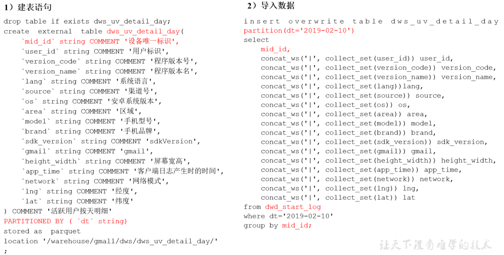

1.1建表语句

```
hive (gmall)>
drop table if exists dws_uv_detail_day;
create external table dws_uv_detail_day
(
    `mid_id` string COMMENT '设备唯一标识',
    `user_id` string COMMENT '用户标识', 
    `version_code` string COMMENT '程序版本号', 
    `version_name` string COMMENT '程序版本名', 
    `lang` string COMMENT '系统语言', 
    `source` string COMMENT '渠道号', 
    `os` string COMMENT '安卓系统版本', 
    `area` string COMMENT '区域', 
    `model` string COMMENT '手机型号', 
    `brand` string COMMENT '手机品牌', 
    `sdk_version` string COMMENT 'sdkVersion', 
    `gmail` string COMMENT 'gmail', 
    `height_width` string COMMENT '屏幕宽高',
    `app_time` string COMMENT '客户端日志产生时的时间',
    `network` string COMMENT '网络模式',
    `lng` string COMMENT '经度',
    `lat` string COMMENT '纬度'
)
partitioned by(dt string)
stored as parquet
location '/user/hive/warehouse/gmall/dws/dws_uv_detail_day';
```

1.2数据导入

以用户单日访问为key进行聚合，如果某个用户在一天中使用了两种操作系统、两个系统版本、多个地区，登录不同账号，只取其中之一。

```
hive (gmall)>
set hive.exec.dynamic.partition.mode=nonstrict;

insert overwrite table dws_uv_detail_day 
partition(dt='2019-08-19')
select  
    mid_id,
    concat_ws('|', collect_set(user_id)) user_id,
    concat_ws('|', collect_set(version_code)) version_code,
    concat_ws('|', collect_set(version_name)) version_name,
    concat_ws('|', collect_set(lang))lang,
    concat_ws('|', collect_set(source)) source,
    concat_ws('|', collect_set(os)) os,
    concat_ws('|', collect_set(area)) area, 
    concat_ws('|', collect_set(model)) model,
    concat_ws('|', collect_set(brand)) brand,
    concat_ws('|', collect_set(sdk_version)) sdk_version,
    concat_ws('|', collect_set(gmail)) gmail,
    concat_ws('|', collect_set(height_width)) height_width,
    concat_ws('|', collect_set(app_time)) app_time,
    concat_ws('|', collect_set(network)) network,
    concat_ws('|', collect_set(lng)) lng,
    concat_ws('|', collect_set(lat)) lat
from dwd_start_log
where dt='2019-08-19'
group by mid_id;

################################################################################################

hive (gmall)> select * from dws_uv_detail_day limit 1;
hive (gmall)> select count(*) from dws_uv_detail_day;
```

#### 2.每周活跃设备明细

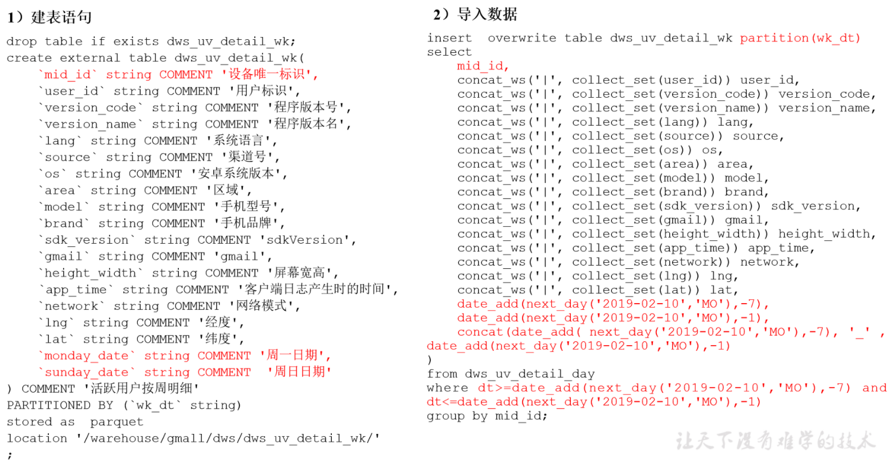

2.1建表语句

```
hive (gmall)>
drop table if exists dws_uv_detail_wk;
create external table dws_uv_detail_wk( 
    `mid_id` string COMMENT '设备唯一标识',
    `user_id` string COMMENT '用户标识', 
    `version_code` string COMMENT '程序版本号', 
    `version_name` string COMMENT '程序版本名', 
    `lang` string COMMENT '系统语言', 
    `source` string COMMENT '渠道号', 
    `os` string COMMENT '安卓系统版本', 
    `area` string COMMENT '区域', 
    `model` string COMMENT '手机型号', 
    `brand` string COMMENT '手机品牌', 
    `sdk_version` string COMMENT 'sdkVersion', 
    `gmail` string COMMENT 'gmail', 
    `height_width` string COMMENT '屏幕宽高',
    `app_time` string COMMENT '客户端日志产生时的时间',
    `network` string COMMENT '网络模式',
    `lng` string COMMENT '经度',
    `lat` string COMMENT '纬度',
    `monday_date` string COMMENT '周一日期',
    `sunday_date` string COMMENT  '周日日期' 
) COMMENT '活跃用户按周明细'
PARTITIONED BY (`wk_dt` string)
stored as parquet
location '/user/hive/warehouse/gmall/dws/dws_uv_detail_wk/';
```

2.2数据导入

```
hive (gmall)>
set hive.exec.dynamic.partition.mode=nonstrict;

insert overwrite table dws_uv_detail_wk partition(wk_dt)
select  
    mid_id,
    concat_ws('|', collect_set(user_id)) user_id,
    concat_ws('|', collect_set(version_code)) version_code,
    concat_ws('|', collect_set(version_name)) version_name,
    concat_ws('|', collect_set(lang)) lang,
    concat_ws('|', collect_set(source)) source,
    concat_ws('|', collect_set(os)) os,
    concat_ws('|', collect_set(area)) area, 
    concat_ws('|', collect_set(model)) model,
    concat_ws('|', collect_set(brand)) brand,
    concat_ws('|', collect_set(sdk_version)) sdk_version,
    concat_ws('|', collect_set(gmail)) gmail,
    concat_ws('|', collect_set(height_width)) height_width,
    concat_ws('|', collect_set(app_time)) app_time,
    concat_ws('|', collect_set(network)) network,
    concat_ws('|', collect_set(lng)) lng,
    concat_ws('|', collect_set(lat)) lat,
    date_add(next_day('2019-08-19','MO'),-7),
    date_add(next_day('2019-08-19','MO'),-1),
    concat(date_add( next_day('2019-08-19','MO'),-7), '_' , date_add(next_day('2019-08-19','MO'),-1) 
)
from dws_uv_detail_day 
where dt>=date_add(next_day('2019-08-19','MO'),-7) and dt<=date_add(next_day('2019-08-19','MO'),-1) 
group by mid_id;

################################################################################################
hive (gmall)> select * from dws_uv_detail_wk limit 1;
hive (gmall)> select count(*) from dws_uv_detail_wk;
```

#### 3.每月活跃设备明细

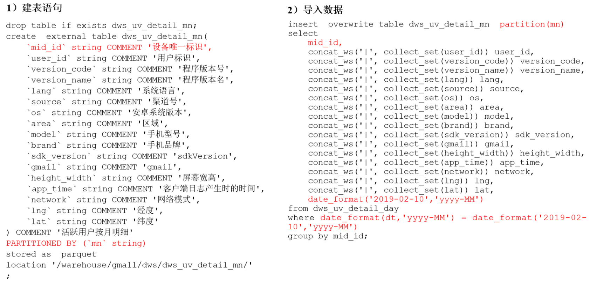

3.1建表语句

```
hive (gmall)>
drop table if exists dws_uv_detail_mn;

create external table dws_uv_detail_mn( 
    `mid_id` string COMMENT '设备唯一标识',
    `user_id` string COMMENT '用户标识', 
    `version_code` string COMMENT '程序版本号', 
    `version_name` string COMMENT '程序版本名', 
    `lang` string COMMENT '系统语言', 
    `source` string COMMENT '渠道号', 
    `os` string COMMENT '安卓系统版本', 
    `area` string COMMENT '区域', 
    `model` string COMMENT '手机型号', 
    `brand` string COMMENT '手机品牌', 
    `sdk_version` string COMMENT 'sdkVersion', 
    `gmail` string COMMENT 'gmail', 
    `height_width` string COMMENT '屏幕宽高',
    `app_time` string COMMENT '客户端日志产生时的时间',
    `network` string COMMENT '网络模式',
    `lng` string COMMENT '经度',
    `lat` string COMMENT '纬度'
) COMMENT '活跃用户按月明细'
PARTITIONED BY (`mn` string)
stored as parquet
location '/user/hive/warehouse/gmall/dws/dws_uv_detail_mn/';
```

3.2数据导入

```
hive (gmall)>
set hive.exec.dynamic.partition.mode=nonstrict;

insert overwrite table dws_uv_detail_mn partition(mn)
select  
    mid_id,
    concat_ws('|', collect_set(user_id)) user_id,
    concat_ws('|', collect_set(version_code)) version_code,
    concat_ws('|', collect_set(version_name)) version_name,
    concat_ws('|', collect_set(lang)) lang,
    concat_ws('|', collect_set(source)) source,
    concat_ws('|', collect_set(os)) os,
    concat_ws('|', collect_set(area)) area, 
    concat_ws('|', collect_set(model)) model,
    concat_ws('|', collect_set(brand)) brand,
    concat_ws('|', collect_set(sdk_version)) sdk_version,
    concat_ws('|', collect_set(gmail)) gmail,
    concat_ws('|', collect_set(height_width)) height_width,
    concat_ws('|', collect_set(app_time)) app_time,
    concat_ws('|', collect_set(network)) network,
    concat_ws('|', collect_set(lng)) lng,
    concat_ws('|', collect_set(lat)) lat,
    date_format('2019-08-19','yyyy-MM')
from dws_uv_detail_day
where date_format(dt,'yyyy-MM') = date_format('2019-08-19','yyyy-MM')
group by mid_id;

################################################################################################
hive (gmall)> select * from dws_uv_detail_mn limit 1;
hive (gmall)> select count(*) from dws_uv_detail_mn ;
```

#### 4.DWS层加载数据脚本(dws_uv_log.sh)

```
#!/bin/bash

# 定义变量方便修改
APP=gmall
hive=/root/apache-hive-1.2.1-bin/bin/hive

# 如果是输入的日期按照取输入日期；如果没输入日期取当前时间的前一天
if [ -n "$1" ] ;then
	do_date=$1
else 
	do_date=`date -d "-1 day" +%F`  
fi 


sql="
  set hive.exec.dynamic.partition.mode=nonstrict;

  insert overwrite table "$APP".dws_uv_detail_day partition(dt='$do_date')
  select  
    mid_id,
    concat_ws('|', collect_set(user_id)) user_id,
    concat_ws('|', collect_set(version_code)) version_code,
    concat_ws('|', collect_set(version_name)) version_name,
    concat_ws('|', collect_set(lang)) lang,
    concat_ws('|', collect_set(source)) source,
    concat_ws('|', collect_set(os)) os,
    concat_ws('|', collect_set(area)) area, 
    concat_ws('|', collect_set(model)) model,
    concat_ws('|', collect_set(brand)) brand,
    concat_ws('|', collect_set(sdk_version)) sdk_version,
    concat_ws('|', collect_set(gmail)) gmail,
    concat_ws('|', collect_set(height_width)) height_width,
    concat_ws('|', collect_set(app_time)) app_time,
    concat_ws('|', collect_set(network)) network,
    concat_ws('|', collect_set(lng)) lng,
    concat_ws('|', collect_set(lat)) lat
  from "$APP".dwd_start_log
  where dt='$do_date'  
  group by mid_id;


  insert overwrite table "$APP".dws_uv_detail_wk partition(wk_dt)
  select  
    mid_id,
    concat_ws('|', collect_set(user_id)) user_id,
    concat_ws('|', collect_set(version_code)) version_code,
    concat_ws('|', collect_set(version_name)) version_name,
    concat_ws('|', collect_set(lang)) lang,
    concat_ws('|', collect_set(source)) source,
    concat_ws('|', collect_set(os)) os,
    concat_ws('|', collect_set(area)) area, 
    concat_ws('|', collect_set(model)) model,
    concat_ws('|', collect_set(brand)) brand,
    concat_ws('|', collect_set(sdk_version)) sdk_version,
    concat_ws('|', collect_set(gmail)) gmail,
    concat_ws('|', collect_set(height_width)) height_width,
    concat_ws('|', collect_set(app_time)) app_time,
    concat_ws('|', collect_set(network)) network,
    concat_ws('|', collect_set(lng)) lng,
    concat_ws('|', collect_set(lat)) lat,
    date_add(next_day('$do_date','MO'),-7),
    date_add(next_day('$do_date','MO'),-1),
    concat(date_add( next_day('$do_date','MO'),-7), '_' , date_add(next_day('$do_date','MO'),-1) 
  )
  from "$APP".dws_uv_detail_day
  where dt>=date_add(next_day('$do_date','MO'),-7) and dt<=date_add(next_day('$do_date','MO'),-1) 
  group by mid_id; 


  insert overwrite table "$APP".dws_uv_detail_mn partition(mn)
  select
    mid_id,
    concat_ws('|', collect_set(user_id)) user_id,
    concat_ws('|', collect_set(version_code)) version_code,
    concat_ws('|', collect_set(version_name)) version_name,
    concat_ws('|', collect_set(lang))lang,
    concat_ws('|', collect_set(source)) source,
    concat_ws('|', collect_set(os)) os,
    concat_ws('|', collect_set(area)) area, 
    concat_ws('|', collect_set(model)) model,
    concat_ws('|', collect_set(brand)) brand,
    concat_ws('|', collect_set(sdk_version)) sdk_version,
    concat_ws('|', collect_set(gmail)) gmail,
    concat_ws('|', collect_set(height_width)) height_width,
    concat_ws('|', collect_set(app_time)) app_time,
    concat_ws('|', collect_set(network)) network,
    concat_ws('|', collect_set(lng)) lng,
    concat_ws('|', collect_set(lat)) lat,
    date_format('$do_date','yyyy-MM')
  from "$APP".dws_uv_detail_day
  where date_format(dt,'yyyy-MM') = date_format('$do_date','yyyy-MM')   
  group by mid_id;
"

$hive -e "$sql"
```

### ADS层

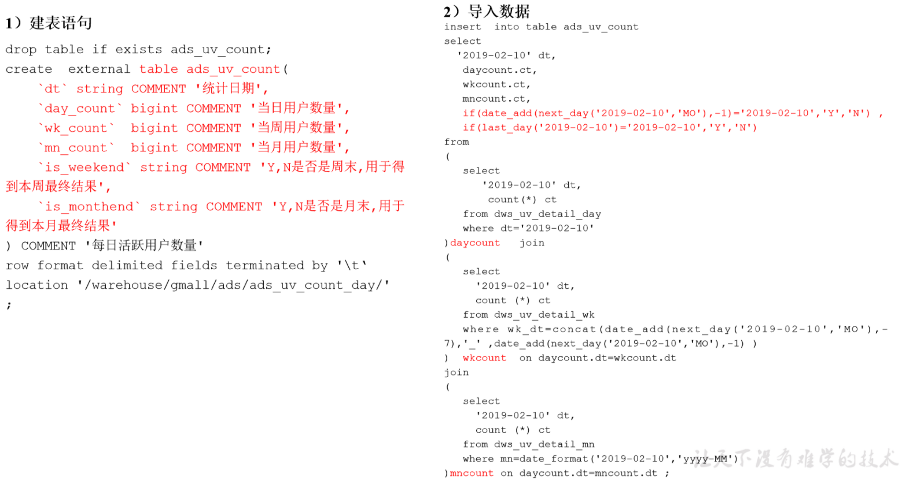

#### 1.活跃设备数

1.1建表语句

```
hive (gmall)>
drop table if exists ads_uv_count;
  create external table ads_uv_count(
         `dt` string COMMENT '统计日期',
         `day_count` bigint COMMENT '当日用户数量',
         `wk_count`  bigint  COMMENT '当周用户数量',
          `mn_count`  bigint  COMMENT  '当月用户数量',
          `is_weekend`  string  COMMENT 'Y,N是否是周末,用于得到本周最终结果',
           `is_monthend`  string  COMMENT  'Y,N是否是月末,用于得到本月最终结果'
          ) COMMENT '活跃设备数'
           row format delimited fields terminated by '\t'
           location '/user/hive/warehouse/gmall/ads/ads_uv_count/' ;
```

1.2导入数据

```
hive (gmall)>
insert into table ads_uv_count 
select  
  '2019-08-19' dt,
   daycount.ct,
   wkcount.ct,
   mncount.ct,
   if(date_add(next_day('2019-08-19','MO'),-1)='2019-08-19','Y','N') ,
   if(last_day('2019-08-19')='2019-08-19','Y','N') 
from 
(
   select  
      '2019-08-19' dt,
       count(*) ct
   from dws_uv_detail_day
   where dt='2019-08-19'  
)daycount join 
( 
   select  
     '2019-08-19' dt,
     count (*) ct
   from dws_uv_detail_wk
   where wk_dt=concat(date_add(next_day('2019-08-19','MO'),-7),'_' ,date_add(next_day('2019-08-19','MO'),-1) )
) wkcount on daycount.dt=wkcount.dt
join 
( 
   select  
     '2019-08-19' dt,
     count (*) ct
   from dws_uv_detail_mn
   where mn=date_format('2019-08-19','yyyy-MM')  
)mncount on daycount.dt=mncount.dt
;

################################################################################################
hive (gmall)> select * from ads_uv_count ;
```

#### 2.ADS层加载数据脚本

```
#!/bin/bash

# 定义变量方便修改
APP=gmall
hive=/root/apache-hive-1.2.1-bin/bin/hive

# 如果是输入的日期按照取输入日期；如果没输入日期取当前时间的前一天
if [ -n "$1" ] ;then
	do_date=$1
else 
	do_date=`date -d "-1 day" +%F`  
fi 

sql="
  set hive.exec.dynamic.partition.mode=nonstrict;

insert into table "$APP".ads_uv_count 
select  
  '$do_date' dt,
   daycount.ct,
   wkcount.ct,
   mncount.ct,
   if(date_add(next_day('$do_date','MO'),-1)='$do_date','Y','N') ,
   if(last_day('$do_date')='$do_date','Y','N') 
from 
(
   select  
      '$do_date' dt,
       count(*) ct
   from "$APP".dws_uv_detail_day
   where dt='$do_date'  
)daycount   join 
( 
   select  
     '$do_date' dt,
     count (*) ct
   from "$APP".dws_uv_detail_wk
   where wk_dt=concat(date_add(next_day('$do_date','MO'),-7),'_' ,date_add(next_day('$do_date','MO'),-1) )
)  wkcount  on daycount.dt=wkcount.dt
join 
( 
   select  
     '$do_date' dt,
     count (*) ct
   from "$APP".dws_uv_detail_mn
   where mn=date_format('$do_date','yyyy-MM')  
)mncount on daycount.dt=mncount.dt;
"

$hive -e "$sql"
```

## 需求二：用户新增主题

首次联网使用应用的用户。如果一个用户首次打开某APP，那这个用户定义为新增用户；卸载再安装的设备，不会被算作一次新增。新增用户包括日新增用户、周新增用户、月新增用户。

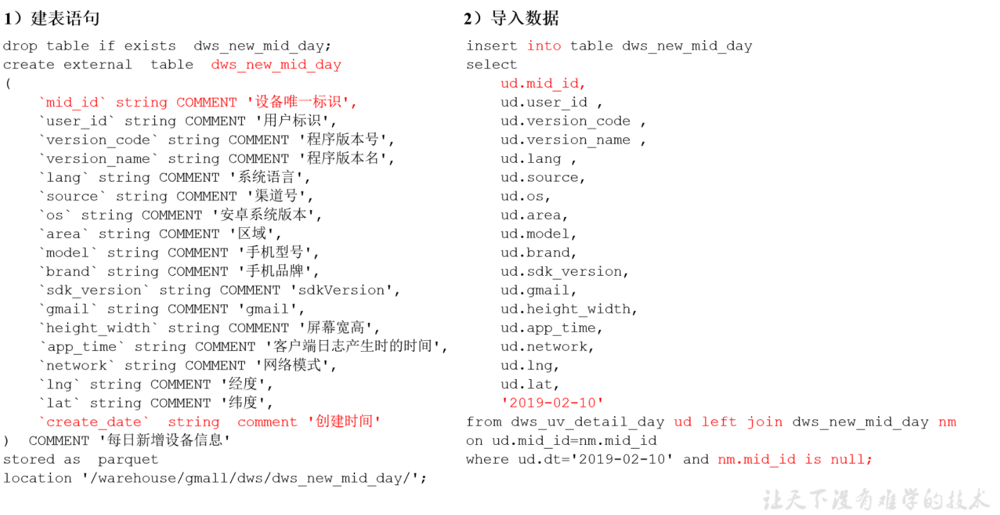

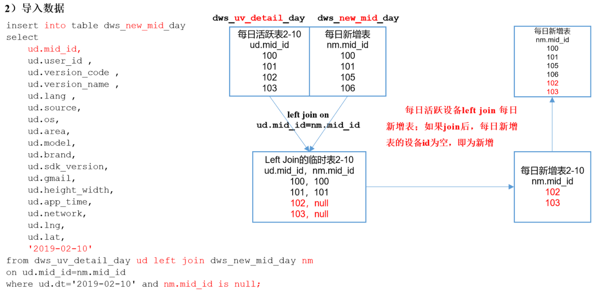

### DWS层

#### 1.每日新增设备明细表

1.1建表语句

```
hive (gmall)>
drop table if exists dws_new_mid_day;
create external table dws_new_mid_day
(
    `mid_id` string COMMENT '设备唯一标识',
    `user_id` string COMMENT '用户标识', 
    `version_code` string COMMENT '程序版本号', 
    `version_name` string COMMENT '程序版本名', 
    `lang` string COMMENT '系统语言', 
    `source` string COMMENT '渠道号', 
    `os` string COMMENT '安卓系统版本', 
    `area` string COMMENT '区域', 
    `model` string COMMENT '手机型号', 
    `brand` string COMMENT '手机品牌', 
    `sdk_version` string COMMENT 'sdkVersion', 
    `gmail` string COMMENT 'gmail', 
    `height_width` string COMMENT '屏幕宽高',
    `app_time` string COMMENT '客户端日志产生时的时间',
    `network` string COMMENT '网络模式',
    `lng` string COMMENT '经度',
    `lat` string COMMENT '纬度',
    `create_date`  string  comment '创建时间' 
)  COMMENT '每日新增设备信息'
stored as parquet
location '/user/hive/warehouse/gmall/dws/dws_new_mid_day/';
```

1.2导入数据

```
hive (gmall)>
insert into table dws_new_mid_day
select  
    ud.mid_id,
    ud.user_id , 
    ud.version_code , 
    ud.version_name , 
    ud.lang , 
    ud.source, 
    ud.os, 
    ud.area, 
    ud.model, 
    ud.brand, 
    ud.sdk_version, 
    ud.gmail, 
    ud.height_width,
    ud.app_time,
    ud.network,
    ud.lng,
    ud.lat,
    '2019-08-19'
from dws_uv_detail_day ud left join dws_new_mid_day nm on ud.mid_id=nm.mid_id
where ud.dt='2019-08-19' and nm.mid_id is null;

################################################################################################

hive (gmall)> select count(*) from dws_new_mid_day ;
hive (gmall)> select * from dws_new_mid_day ;
```

### ADS层

#### 1.每日新增设备表

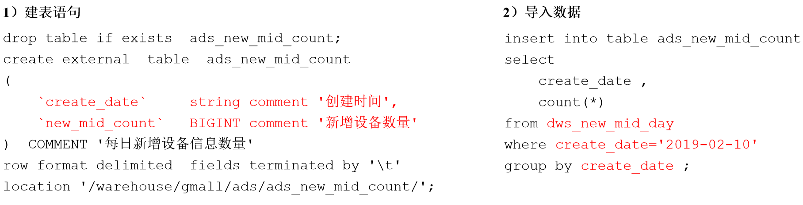

1.1建表语句

```
hive (gmall)>
drop table if exists ads_new_mid_count;
 create external table ads_new_mid_count(
             `create_date`  string comment '创建时间',
            `new_mid_count` BIGINT comment '新增设备数量'
             ) COMMENT '每日新增设备信息数量'
             row format delimited fields terminated by '\t'
             location '/user/hive/warehouse/gmall/ads/ads_new_mid_count/';
```

1.2导入数据

```
hive (gmall)>
insert into table ads_new_mid_count 
select
create_date,
count(*)
from dws_new_mid_day
where create_date='2019-08-19'
group by create_date;

################################################################################################

hive (gmall)> select * from ads_new_mid_count;

```

## 需求三：用户留存主题

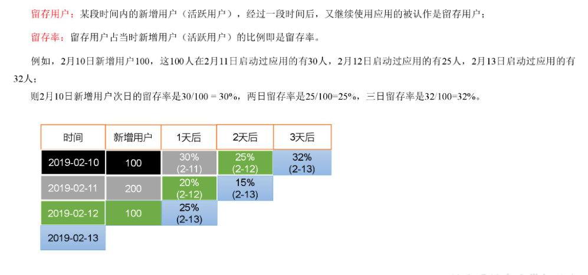

### 新数据准备

为了分析沉默用户、本周回流用户数、流失用户、最近连续3周活跃用户、最近七天内连续三天活跃用户数，需要准备2019-08-23、2019-08-23日的数据。

```
1.1修改日志时间

[root@Master code]#  dt.sh 2019-08-23

1.2启动集群：dfs，yarn，kafka，flume

1.3生成日志数据
[root@Master code]#  lg.sh

1.4将HDFS数据导入到ODS层
[root@Master code]#  ods_log.sh 2019-08-22

1.5将ODS数据导入到DWD层
[root@Master code]#  dwd_start_log.sh 2019-08-22
[root@Master code]#  dwd_base_log.sh 2019-08-22
[root@Master code]#  dwd_event_log.sh 2019-08-22

1.6将DWD数据导入到DWS层
[root@Master code]#  dws_uv_log.sh 2019-08-22

1.7验证
hive (gmall)> select * from dws_uv_detail_day where dt='2019-08-20' limit 2;
hive (gmall)> select * from dws_uv_detail_day where dt='2019-08-21' limit 2;
hive (gmall)> select * from dws_uv_detail_day where dt='2019-09-22' limit 2;

select * from dws_uv_detail_wk where dt='2019-09-12' limit 2;

################################################################################################


1.1修改日志时间

[root@Master code]# ./dt.sh 2019-08-28

1.2启动集群：dfs，yarn，kafka，flume

1.3生成日志数据
[root@Master code]#  lg.sh

1.4将HDFS数据导入到ODS层
[root@Master code]#  ./ods_log.sh 2019-08-20

1.5将ODS数据导入到DWD层
[root@Master code]#  ./dwd_start_log.sh 2019-08-20
[root@Master code]#  ./dwd_base_log.sh 2019-08-20
[root@Master code]#  ./dwd_event_log.sh  2019-08-20

1.6将DWD数据导入到DWS层
[root@Master code]# ./dws_uv_log.sh 2019-08-20

1.7验证
hive (gmall)> select * from dws_uv_detail_day where dt='2019-08-20' limit 2;
```

### DWS

#### 1.每日留存用户明细表

1.1建表语句

```
hive (gmall)>
drop table if exists dws_user_retention_day;
create external table dws_user_retention_day 
(
    `mid_id` string COMMENT '设备唯一标识',
    `user_id` string COMMENT '用户标识', 
    `version_code` string COMMENT '程序版本号', 
    `version_name` string COMMENT '程序版本名', 
`lang` string COMMENT '系统语言', 
`source` string COMMENT '渠道号', 
`os` string COMMENT '安卓系统版本', 
`area` string COMMENT '区域', 
`model` string COMMENT '手机型号', 
`brand` string COMMENT '手机品牌', 
`sdk_version` string COMMENT 'sdkVersion', 
`gmail` string COMMENT 'gmail', 
`height_width` string COMMENT '屏幕宽高',
`app_time` string COMMENT '客户端日志产生时的时间',
`network` string COMMENT '网络模式',
`lng` string COMMENT '经度',
`lat` string COMMENT '纬度',
`create_date` string  comment '设备新增时间',
 `retention_day` int comment '截止当前日期留存天数'
)  COMMENT '每日用户留存情况'
PARTITIONED BY (`dt` string)
stored as parquet
location '/user/hive/warehouse/gmall/dws/dws_user_retention_day/';
```

1.2导入数据

```
hive (gmall)>
insert overwrite table dws_user_retention_day
partition(dt="2019-09-04")
select  
    nm.mid_id,
    nm.user_id , 
    nm.version_code , 
    nm.version_name , 
    nm.lang , 
    nm.source, 
    nm.os, 
    nm.area, 
    nm.model, 
    nm.brand, 
    nm.sdk_version, 
    nm.gmail, 
    nm.height_width,
    nm.app_time,
    nm.network,
    nm.lng,
    nm.lat,
nm.create_date,
1 retention_day 
from dws_uv_detail_day ud join dws_new_mid_day nm on ud.mid_id =nm.mid_id 
where ud.dt='2019-09-04' and nm.create_date=date_add('2019-09-04',-1);

################################################################################################
hive (gmall)> select count(*) from dws_user_retention_day;
```

#### 2.1,2,3,n天留存用户明细表

2.1导入数据

```
insert overwrite table dws_user_retention_day
partition(dt="2019-08-22")
select
    nm.mid_id,
    nm.user_id,
    nm.version_code,
    nm.version_name,
    nm.lang,
    nm.source,
    nm.os,
    nm.area,
    nm.model,
    nm.brand,
    nm.sdk_version,
    nm.gmail,
    nm.height_width,
    nm.app_time,
    nm.network,
    nm.lng,
    nm.lat,
    nm.create_date,
    1 retention_day 
from dws_uv_detail_day ud join dws_new_mid_day nm  on ud.mid_id =nm.mid_id 
where ud.dt='2019-08-22' and nm.create_date=date_add('2019-08-22',-1)

union all
select  
    nm.mid_id,
    nm.user_id , 
    nm.version_code , 
    nm.version_name , 
    nm.lang , 
    nm.source, 
    nm.os, 
    nm.area, 
    nm.model, 
    nm.brand, 
    nm.sdk_version, 
    nm.gmail, 
    nm.height_width,
    nm.app_time,
    nm.network,
    nm.lng,
    nm.lat,
    nm.create_date,
    2 retention_day 
from  dws_uv_detail_day ud join dws_new_mid_day nm   on ud.mid_id =nm.mid_id 
where ud.dt='2019-08-22' and nm.create_date=date_add('2019-08-22',-2)

union all
select  
    nm.mid_id,
    nm.user_id , 
    nm.version_code , 
    nm.version_name , 
    nm.lang , 
    nm.source, 
    nm.os, 
    nm.area, 
    nm.model, 
    nm.brand, 
    nm.sdk_version, 
    nm.gmail, 
    nm.height_width,
    nm.app_time,
    nm.network,
    nm.lng,
    nm.lat,
    nm.create_date,
    3 retention_day 
from  dws_uv_detail_day ud join dws_new_mid_day nm   on ud.mid_id =nm.mid_id 
where ud.dt='2019-08-22' and nm.create_date=date_add('2019-08-22',-3);

################################################################################################

hive (gmall)> select retention_day , count(*) from dws_user_retention_day group by retention_day;
hive (gmall)> select * from dws_user_retention_day;
```

### ADS层

#### 1.留存用户数

1.1建表语句

```
drop table if exists ads_user_retention_day_count;
create external table ads_user_retention_day_count 
(
  `create_date`  string  comment '设备新增日期',
  `retention_day`  int comment '截止当前日期留存天数',
  `retention_count`    bigint comment  '留存数量'
)  COMMENT '每日用户留存情况'
row format delimited fields terminated by '\t'
location '/user/hive/warehouse/gmall/ads/ads_user_retention_day_count/';
```

1.2导入数据

```
hive (gmall)>
insert into table ads_user_retention_day_count 
select
    create_date,
    retention_day,
    count(*) retention_count
from dws_user_retention_day
where dt='2019-08-22' 
group by create_date,retention_day;

################################################################################################

hive (gmall)> select * from ads_user_retention_day_count;
```

#### 2.留存用户比率

2.1建表语句

```
hive (gmall)>
drop table if exists ads_user_retention_day_rate;
create external table ads_user_retention_day_rate 
(
 `stat_date`          string comment '统计日期',
 `create_date`  string  comment '设备新增日期',
 `retention_day`  int comment '截止当前日期留存天数',
 `retention_count`    bigint comment  '留存数量',
 `new_mid_count`  bigint comment '当日设备新增数量',
 `retention_ratio`  decimal(10,2) comment '留存率'
)  COMMENT '每日用户留存情况'
row format delimited fields terminated by '\t'
location '/user/hive/warehouse/gmall/ads/ads_user_retention_day_rate/';
```

2.2导入数据

```
hive (gmall)>
insert into table ads_user_retention_day_rate
select 
    '2019-08-28', 
    ur.create_date,
    ur.retention_day, 
    ur.retention_count, 
    nc.new_mid_count,
    ur.retention_count/nc.new_mid_count*100
from 
(
    select
        create_date,
        retention_day,
        count(*) retention_count
    from dws_user_retention_day
    where dt='2019-08-28' 
    group by create_date,retention_day
) ur join ads_new_mid_count nc on nc.create_date=ur.create_date;

################################################################################################

hive (gmall)>select * from ads_user_retention_day_rate;
```

## 需求四：沉默用户数

沉默用户：指的是只在安装当天启动过，且启动时间是在一周前。

### DWS层

使用日活明细表dws_uv_detail_day作为DWS层数据。

### ADS层

#### 1.沉默用户数

1.1建表语句

```
hive (gmall)>
drop table if exists ads_slient_count;
create external table ads_slient_count( 
    `dt` string COMMENT '统计日期',
    `slient_count` bigint COMMENT '沉默设备数'
) 
row format delimited fields terminated by '\t'
location '/user/hive/warehouse/gmall/ads/ads_slient_count';
```

1.2导入2019-08-23数据

```
hive (gmall)>
insert into table ads_slient_count
select 
    '2019-08-22' dt,
    count(*) slient_count
from 
(
    select mid_id
    from dws_uv_detail_day
    where dt<='2019-08-22'
    group by mid_id
    having count(*)=1 and min(dt)<date_add('2019-08-22',-7)
) t1;

################################################################################################
hive (gmall)> select * from ads_slient_count;
```

1.3编写脚本

```
#!/bin/bash

hive=/root/apache-hive-1.2.1-bin/bin/hive
APP=gmall

if [ -n "$1" ];then
	do_date=$1
else
	do_date=`date -d "-1 day" +%F`
fi

echo "-----------导入日期$do_date-----------"

sql="
insert into table "$APP".ads_slient_count
select 
    '$do_date' dt,
    count(*) slient_count
from 
(
    select 
        mid_id
    from "$APP".dws_uv_detail_day
    where dt<='$do_date'
    group by mid_id
    having count(*)=1 and min(dt)<=date_add('$do_date',-7)
)t1;"

$hive -e "$sql"
```

## 需求五：本周回流用户数

本周回流=本周活跃-本周新增-上周活跃

### DWS层

使用日活明细表dws_uv_detail_day作为DWS层数据

### ADS层

#### 1.本周回流用户数

1.1建表语句

```
hive (gmall)>
drop table if exists ads_back_count;
create external table ads_back_count( 
    `dt` string COMMENT '统计日期',
    `wk_dt` string COMMENT '统计日期所在周',
    `wastage_count` bigint COMMENT '回流设备数'
) 
row format delimited fields terminated by '\t'
location '/user/hive/warehouse/gmall/ads/ads_back_count';
```

1.2导入数据

```
hive (gmall)> 
insert into table ads_back_count
select 
   '2019-09-04' dt,
   concat(date_add(next_day('2019-09-04','MO'),-7),'_',date_add(next_day('2019-09-04','MO'),-1)) wk_dt,
   count(*)
from 
(
    select t1.mid_id
    from 
    (
        select	mid_id
        from dws_uv_detail_wk
  where wk_dt=concat(date_add(next_day('2019-09-04','MO'),-7),'_',date_add(next_day('2019-09-04','MO'),-1))
    )t1
    left join
    (
        select mid_id
        from dws_new_mid_day
        where create_date<=date_add(next_day('2019-09-04','MO'),-1) and create_date>=date_add(next_day('2019-09-04','MO'),-7)
    )t2
    on t1.mid_id=t2.mid_id
    left join
    (
        select mid_id
        from dws_uv_detail_wk
        where wk_dt=concat(date_add(next_day('2019-09-04','MO'),-7*2),'_',date_add(next_day('2019-9-04','MO'),-7-1))
    )t3
    on t1.mid_id=t3.mid_id
    where t2.mid_id is null and t3.mid_id is null
)t4;

################################################################################################

hive (gmall)> select * from ads_back_count;
```

1.3编写脚本

```
#!/bin/bash

if [ -n "$1" ];then
	do_date=$1
else
	do_date=`date -d "-1 day" +%F`
fi

hive=/root/apache-hive-1.2.1-bin/bin/hive
APP=gmall

echo "-----------导入日期$do_date-----------"

sql="
insert into table "$APP".ads_back_count
select 
       '$do_date' dt,
       concat(date_add(next_day('$do_date','MO'),-7),'_',date_add(next_day('$do_date','MO'),-1)) wk_dt,
       count(*)
from 
(
    select t1.mid_id
    from 
    (
        select mid_id
        from "$APP".dws_uv_detail_wk
        where wk_dt=concat(date_add(next_day('$do_date','MO'),-7),'_',date_add(next_day('$do_date','MO'),-1))
    )t1
    left join
    (
        select mid_id
        from "$APP".dws_new_mid_day
        where create_date<=date_add(next_day('$do_date','MO'),-1) and create_date>=date_add(next_day('$do_date','MO'),-7)
    )t2
    on t1.mid_id=t2.mid_id
    left join
    (
        select mid_id
        from "$APP".dws_uv_detail_wk
        where wk_dt=concat(date_add(next_day('$do_date','MO'),-7*2),'_',date_add(next_day('$do_date','MO'),-7-1))
    )t3
    on t1.mid_id=t3.mid_id
    where t2.mid_id is null and t3.mid_id is null
)t4;
"

$hive -e "$sql"
```

## 需求六：流失用户数

流失用户：最近7天未登录我们称之为流失用户

### DWS层

使用日活明细表dws_uv_detail_day作为DWS层数据

### ADS层

#### 1.流失用户数

1.1建表语句

```
hive (gmall)>
drop table if exists ads_wastage_count;
create external table ads_wastage_count( 
    `dt` string COMMENT '统计日期',
    `wastage_count` bigint COMMENT '流失设备数'
) 
row format delimited fields terminated by '\t'
location '/user/hive/warehouse/gmall/ads/ads_wastage_count';
```

1.2导入2019-08-28数据

```
hive (gmall)>
insert into table ads_wastage_count
select
     '2019-08-28',
     count(*)
from 
(
    select mid_id
from dws_uv_detail_day
    group by mid_id
    having max(dt)<=date_add('2019-08-28',-7)
)t1;


################################################################################################

hive (gmall)> select * from ads_wastage_count;
```

1.3编写脚本

```
#!/bin/bash

if [ -n "$1" ];then
	do_date=$1
else
	do_date=`date -d "-1 day" +%F`
fi

hive=/root/apache-hive-1.2.1-bin/bin/hive
APP=gmall

echo "-----------导入日期$do_date-----------"

sql="
insert into table "$APP".ads_wastage_count
select
     '$do_date',
     count(*)
from 
(
    select mid_id
    from "$APP".dws_uv_detail_day
    group by mid_id
    having max(dt)<=date_add('$do_date',-7)
)t1;
"

$hive -e "$sql"
```

## 需求七：最近连续3周活跃用户数

最近3周连续活跃的用户：通常是周一对前3周的数据做统计，该数据一周计算一次。

### DWS层

使用周活明细表dws_uv_detail_wk作为DWS层数据

## **ADS层**

#### 1.最近连续3周活跃用户数

1.1建表语句

```
hive (gmall)>
drop table if exists ads_continuity_wk_count;
create external table ads_continuity_wk_count( 
    `dt` string COMMENT '统计日期,一般用结束周周日日期,如果每天计算一次,可用当天日期',
    `wk_dt` string COMMENT '持续时间',
    `continuity_count` bigint
) 
row format delimited fields terminated by '\t'
location '/user/hive/warehouse/gmall/ads/ads_continuity_wk_count';
```

1.2导入数据

```
hive (gmall)>
insert into table ads_continuity_wk_count
select 
     '2019-09-04',
     concat(date_add(next_day('2019-09-04','MO'),-7*3),'_',date_add(next_day('2019-09-04','MO'),-1)),
     count(*)
from 
(
    select mid_id
    from dws_uv_detail_wk
    where wk_dt>=concat(date_add(next_day('2019-09-04','MO'),-7*3),'_',date_add(next_day('2019-09-04','MO'),-7*2-1)) 
    and wk_dt<=concat(date_add(next_day('2019-09-04','MO'),-7),'_',date_add(next_day('2019-09-04','MO'),-1))
    group by mid_id
    having count(*)=3
)t1;

################################################################################################

hive (gmall)> select * from ads_continuity_wk_count;
```

1.3编写脚本

```
#!/bin/bash

if [ -n "$1" ];then
	do_date=$1
else
	do_date=`date -d "-1 day" +%F`
fi

hive=/root/apache-hive-1.2.1-bin/bin/hive
APP=gmall

echo "-----------导入日期$do_date-----------"

sql="
insert into table "$APP".ads_continuity_wk_count
select 
     '$do_date',
     concat(date_add(next_day('$do_date','MO'),-7*3),'_',date_add(next_day('$do_date','MO'),-1)),
     count(*)
from 
(
    select mid_id
    from "$APP".dws_uv_detail_wk
    where wk_dt>=concat(date_add(next_day('$do_date','MO'),-7*3),'_',date_add(next_day('$do_date','MO'),-7*2-1)) 
    and wk_dt<=concat(date_add(next_day('$do_date','MO'),-7),'_',date_add(next_day('$do_date','MO'),-1))
    group by mid_id
    having count(*)=3
)t1;"

$hive -e "$sql"

################################################################################################

hive (gmall)> select * from ads_continuity_wk_count;
```

## 需求八：最近七天内连续三天活跃用户数

说明：最近7天内连续3天活跃用户数

### DWS层

使用日活明细表dws_uv_detail_day作为DWS层数据

### ADS层

#### 1.最近七天内连续三天活跃用户数

1.1建表语句

```
hive (gmall)>
drop table if exists ads_continuity_uv_count;
create external table ads_continuity_uv_count( 
    `dt` string COMMENT '统计日期',
    `wk_dt` string COMMENT '最近7天日期',
    `continuity_count` bigint
) COMMENT '连续活跃设备数'
row format delimited fields terminated by '\t'
location '/user/hive/warehouse/gmall/ads/ads_continuity_uv_count';
```

1.2导入数据

```
  hive (gmall)>
insert into table ads_continuity_uv_count
select
    '2019-08-22',
    concat(date_add('2019-08-22',-6),'_','2019-08-22'),
    count(*)
from
(
    select mid_id
    from
    (
        select mid_id      
        from
        (
            select 
                mid_id,
                date_sub(dt,rank) date_dif
            from
            (
                select 
                    mid_id,
                    dt,
                    rank() over(partition by mid_id order by dt) rank
                from dws_uv_detail_day
                where dt>=date_add('2019-08-22',-6) and dt<='2019-08-22'
            )t1
        )t2 
        group by mid_id,date_dif
        having count(*)>=3
    )t3 
    group by mid_id
)t4;


################################################################################################

hive (gmall)> select * from ads_continuity_uv_count;
```

1.3编写脚本

```
#!/bin/bash

if [ -n "$1" ];then
	do_date=$1
else
	do_date=`date -d "-1 day" +%F`
fi

hive=/root/apache-hive-1.2.1-bin/bin/hive
APP=gmall

echo "-----------导入日期$do_date-----------"

sql="
insert into table "$APP".ads_continuity_uv_count
select 
     '$do_date',
     concat(date_add('$do_date',-6),'_','$do_date') dt,
     count(*) 
from 
(
    select mid_id
    from
    (
        select mid_id
        from 
        (
            select
                mid_id,
                date_sub(dt,rank) date_diff
            from 
            (
                select 
                    mid_id,
                    dt,
                    rank() over(partition by mid_id order by dt) rank
                from "$APP".dws_uv_detail_day
                where dt>=date_add('$do_date',-6) and dt<='$do_date'
            )t1
        )t2
        group by mid_id,date_diff
        having count(*)>=3
    )t3 
    group by mid_id
)t4;
"

$hive -e "$sql"
```

## 安装Sqoop

安装Sqoop的前提是已经具备Java和Hadoop的环境

1.解压

```
[root@Master software]# tar -zxvf sqoop-1.4.6.bin__hadoop-2.0.4-alpha.tar.gz  -C /root/
```

2.修改配置文件

```
[root@Master conf]# pwd
/root/sqoop-1.4.6.bin__hadoop-2.0.4-alpha/conf
[root@Master conf]# vim sqoop-env.sh 

export HADOOP_COMMON_HOME=/root/hadoop-2.7.2
export HADOOP_MAPRED_HOME=/root/hadoop-2.7.2
export HBASE_HOME=
export HIVE_HOME=/root/apache-hive-1.2.1-bin
export ZOOCFGDIR=/root/zookeeper-3.4.10
```

3.拷贝JDBC驱动

```
[root@Master mysql-connector-java-5.1.27]# cp mysql-connector-java-5.1.27-bin.jar  /root/sqoop-1.4.6.bin__hadoop-2.0.4-alpha/lib/
```

4.配置环境变量

```
[root@Master bin]# source  /etc/profile
```

5.linux下关于mysql的命令

```
Linux CentOS一般做为服务器使用，因此，MySQL服务应该随开机自动启动的。正常情况下，查看开机自动启动的服务使用chkconfig命令，如下：

chkconfig --list

一、 启动
1、使用 service 启动：service mysql start
2、使用 mysqld 脚本启动：/etc/inint.d/mysql start
3、使用 safe_mysqld 启动：safe_mysql&

二、停止
1、使用 service 启动：service mysql stop
2、使用 mysqld 脚本启动：/etc/inint.d/mysql stop
3、mysqladmin shutdown

三、重启
1、使用 service 启动：service mysql restart
2、使用 mysqld 脚本启动：/etc/inint.d/mysql restart

四、查看mysql状态
使用 service 启动：service mysql status
```

5.测试

```
[root@Master bin]# ./sqoop list-databases --connect jdbc:mysql://192.168.8.11:3306/ --username root --password lx@6688

错误：
java.sql.SQLException: Access denied for user 'root'@'Master' (using password: YES)
可能由于root的权限不够，可以进行如下操作:
//本地操作的权限
GRANT ALL PRIVILEGES ON *.* TO 'root'@'Master' IDENTIFIED BY 'lx@6688' WITH GRANT OPTION; 
//远程操作的权限
GRANT ALL PRIVILEGES ON *.* TO ' root '@'%' IDENTIFIED BY 'lx@6688' WITH GRANT OPTION;
//刷新
FLUSH PRIVILEGES;    

显示如下信息测试成功：
information_schema
gmall
hive
mysql
performa
```

6.sqoop导入命令

```
./sqoop import \
--connect \
--username \
--password \
--target-dir \
--delete-target-dir \
--num-mappers \
--fields-terminated-by \
--query "$2" ' and $CONDITIONS;'
```

7.编写sqoop定时导入脚本(sqoop_import.sh)

```
#!/bin/bash

db_date=$2
echo $db_date
db_name=gmall

import_data() {
/root/sqoop-1.4.6.bin/bin/sqoop import \
--connect jdbc:mysql://Master:3306/$db_name \
--username root \
--password lx@6688 \
--target-dir /origin_data/$db_name/db/$1/$db_date \
--delete-target-dir \
--num-mappers 1 \
--fields-terminated-by "\t" \
--query "$2"' and $CONDITIONS;'
}

import_sku_info(){
  import_data "sku_info" "select 
id, spu_id, price, sku_name, sku_desc, weight, tm_id,
category3_id, create_time
  from sku_info where 1=1"
}

import_user_info(){
  import_data "user_info" "select 
id, name, birthday, gender, email, user_level, 
create_time 
from user_info where 1=1"
}

import_base_category1(){
  import_data "base_category1" "select 
id, name from base_category1 where 1=1"
}

import_base_category2(){
  import_data "base_category2" "select 
id, name, category1_id from base_category2 where 1=1"
}

import_base_category3(){
  import_data "base_category3" "select id, name, category2_id from base_category3 where 1=1"
}

import_order_detail(){
  import_data   "order_detail"   "select 
    od.id, 
    order_id, 
    user_id, 
    sku_id, 
    sku_name, 
    order_price, 
    sku_num, 
    o.create_time  
  from order_info o, order_detail od
  where o.id=od.order_id
  and DATE_FORMAT(create_time,'%Y-%m-%d')='$db_date'"
}

import_payment_info(){
  import_data "payment_info"   "select 
    id,  
    out_trade_no, 
    order_id, 
    user_id, 
    alipay_trade_no, 
    total_amount,  
    subject, 
    payment_type, 
    payment_time 
  from payment_info 
  where DATE_FORMAT(payment_time,'%Y-%m-%d')='$db_date'"
}

import_order_info(){
  import_data   "order_info"   "select 
    id, 
    total_amount, 
    order_status, 
    user_id, 
    payment_way, 
    out_trade_no, 
    create_time, 
    operate_time  
  from order_info 
  where (DATE_FORMAT(create_time,'%Y-%m-%d')='$db_date' or DATE_FORMAT(operate_time,'%Y-%m-%d')='$db_date')"
}

case $1 in
  "base_category1")
     import_base_category1
;;
  "base_category2")
     import_base_category2
;;
  "base_category3")
     import_base_category3
;;
  "order_info")
     import_order_info
;;
  "order_detail")
     import_order_detail
;;
  "sku_info")
     import_sku_info
;;
  "user_info")
     import_user_info
;;
  "payment_info")
     import_payment_info
;;
   "all")
   import_base_category1
   import_base_category2
   import_base_category3
   import_order_info
   import_order_detail
   import_sku_info
   import_user_info
   import_payment_info
;;
esac
```

8.在SQLyog中生成2019年2月11日数据

```
CALL init_data('2019-02-11',1000,200,300,TRUE);
```

9.执行脚本

```
 sqoop_import.sh all 2019-08-16
```

# 业务数仓

## ODS层

完全仿照业务数据库中的表字段，一模一样的创建ODS层对应表。

### 1.创建订单表

1.1建表语句

```
drop table if exists ods_order_info;
create external table ods_order_info (
   `id` string COMMENT '订单编号',
   `total_amount` decimal(10,2) COMMENT '订单金额',
  `order_status` string COMMENT '订单状态',
  `user_id` string COMMENT '用户id',
 `payment_way` string COMMENT '支付方式',
 `out_trade_no` string COMMENT '支付流水号',
 `create_time` string COMMENT '创建时间',
 `operate_time` string COMMENT '操作时间'
) COMMENT '订单表'
PARTITIONED BY (`dt` string)
row format delimited fields terminated by '\t'
location '/user/hive/warehouse/gmall/ods/ods_order_info/'
;
```

### 2.创建订单详情表

2.1建表语句

```
hive (gmall)>
drop table if exists ods_order_detail;
create external table ods_order_detail( 
   `id` string COMMENT '订单编号',
   `order_id` string  COMMENT '订单号', 
   `user_id` string COMMENT '用户id',
 `sku_id` string COMMENT '商品id',
 `sku_name` string COMMENT '商品名称',
 `order_price` string COMMENT '商品价格',
 `sku_num` string COMMENT '商品数量',
 `create_time` string COMMENT '创建时间'
) COMMENT '订单明细表'
PARTITIONED BY (`dt` string)
row format delimited fields terminated by '\t' 
location '/user/hive/warehouse/gmall/ods/ods_order_detail/'
;
```

### 3.创建商品表

3.1建表语句

```
hive (gmall)>
drop table if exists ods_sku_info;
create external table ods_sku_info( 
   `id` string COMMENT 'skuId',
   `spu_id` string  COMMENT 'spuid', 
  `price` decimal(10,2) COMMENT '价格',
 `sku_name` string COMMENT '商品名称',
 `sku_desc` string COMMENT '商品描述',
 `weight` string COMMENT '重量',
 `tm_id` string COMMENT '品牌id',
 `category3_id` string COMMENT '品类id',
 `create_time` string COMMENT '创建时间'
) COMMENT '商品表'
PARTITIONED BY (`dt` string)
row format delimited fields terminated by '\t'
location '/user/hive/warehouse/gmall/ods/ods_sku_info/'
;
```

### 4.创建用户表

4.1建表语句

```
hive (gmall)>
drop table if exists ods_user_info;
create external table ods_user_info( 
   `id` string COMMENT '用户id',
   `name`  string COMMENT '姓名',
  `birthday` string COMMENT '生日',
 `gender` string COMMENT '性别',
 `email` string COMMENT '邮箱',
 `user_level` string COMMENT '用户等级',
 `create_time` string COMMENT '创建时间'
) COMMENT '用户信息'
PARTITIONED BY (`dt` string)
row format delimited fields terminated by '\t'
location '/user/hive/warehouse/gmall/ods/ods_user_info/'
;
```

### 5.创建商品一级分类表

5.1建表语句

```
hive (gmall)>
drop table if exists ods_base_category1;
create external table ods_base_category1( 
   `id` string COMMENT 'id',
  `name`  string COMMENT '名称'
) COMMENT '商品一级分类'
PARTITIONED BY (`dt` string)
row format delimited fields terminated by '\t'
location '/user/hive/warehouse/gmall/ods/ods_base_category1/'
;
```

### 6.创建商品二级分类表

6.1建表语句

```
hive (gmall)>
drop table if exists ods_base_category2;
create external table ods_base_category2( 
   `id` string COMMENT ' id',
   `name` string COMMENT '名称',
  category1_id string COMMENT '一级品类id'
) COMMENT '商品二级分类'
PARTITIONED BY (`dt` string)
row format delimited fields terminated by '\t'
location '/user/hive/warehouse/gmall/ods/ods_base_category2/'
;
```

### 7.创建商品三级分类表

7.1建表语句

```
hive (gmall)>
drop table if exists ods_base_category3;
create external table ods_base_category3(
   `id` string COMMENT ' id',
   `name`  string COMMENT '名称',
  category2_id string COMMENT '二级品类id'
) COMMENT '商品三级分类'
PARTITIONED BY (`dt` string)
row format delimited fields terminated by '\t'
location '/user/hive/warehouse/gmall/ods/ods_base_category3/'
;
```

### 8.创建支付流水表

8.1建表语句

```
hive (gmall)>
drop table if exists ods_payment_info;
create external table ods_payment_info(
`id`  bigint COMMENT '编号',
`out_trade_no`   string COMMENT '对外业务编号',
`order_id`  string COMMENT '订单编号',
`user_id`  string COMMENT '用户编号',
`alipay_trade_no` string COMMENT '支付宝交易流水编号',
`total_amount`  decimal(16,2) COMMENT '支付金额',
`subject` string COMMENT '交易内容',
`payment_type`    string COMMENT '支付类型',
`payment_time`   string COMMENT '支付时间'
 )  COMMENT '支付流水表'
PARTITIONED BY (`dt` string)
row format delimited fields terminated by '\t'
location '/user/hive/warehouse/gmall/ods/ods_payment_info/'
;
```

### 9.ods层数据导入脚本(ods_db.sh)

将mysql导入到hdfs的数据，再导入到hive表中。

```
#!/bin/bash

   APP=gmall
   hive=/root/apache-hive-1.2.1-bin/bin/hive

# 如果是输入的日期按照取输入日期；如果没输入日期取当前时间的前一天
if [ -n "$1" ] ;then
	do_date=$1
else 
	do_date=`date -d "-1 day" +%F`
fi

sql=" 
load data inpath '/origin_data/$APP/db/order_info/$do_date' OVERWRITE into table "$APP".ods_order_info partition(dt='$do_date');

load data inpath '/origin_data/$APP/db/order_detail/$do_date' OVERWRITE into table "$APP".ods_order_detail partition(dt='$do_date');

load data inpath '/origin_data/$APP/db/sku_info/$do_date' OVERWRITE into table "$APP".ods_sku_info partition(dt='$do_date');

load data inpath '/origin_data/$APP/db/user_info/$do_date' OVERWRITE into table "$APP".ods_user_info partition(dt='$do_date');

load data inpath '/origin_data/$APP/db/payment_info/$do_date' OVERWRITE into table "$APP".ods_payment_info partition(dt='$do_date');

load data inpath '/origin_data/$APP/db/base_category1/$do_date' OVERWRITE into table "$APP".ods_base_category1 partition(dt='$do_date');

load data inpath '/origin_data/$APP/db/base_category2/$do_date' OVERWRITE into table "$APP".ods_base_category2 partition(dt='$do_date');

load data inpath '/origin_data/$APP/db/base_category3/$do_date' OVERWRITE into table "$APP".ods_base_category3 partition(dt='$do_date'); 
"
$hive -e "$sql"
```

查看是否导入成功

```
hive (gmall)> 

select * from ods_order_info where dt='2019-08-21' limit 25;
```

## DWD层

对ODS层数据进行判空过滤。对商品分类表进行维度退化（降维）。

### 1.创建订单表

```
hive (gmall)>
drop table if exists dwd_order_info;
create external table dwd_order_info (
   `id` string COMMENT '',
   `total_amount` decimal(10,2) COMMENT '',
   `order_status` string COMMENT ' 1 2 3 4 5',
  `user_id` string COMMENT 'id',
 `payment_way` string COMMENT '',
 `out_trade_no` string COMMENT '',
 `create_time` string COMMENT '',
 `operate_time` string COMMENT ''
) 
PARTITIONED BY (`dt` string)
stored as parquet
location '/user/hive/warehouse/gmall/dwd/dwd_order_info/'
tblproperties ("parquet.compression"="snappy")
;
```

### 2.创建订单详情表

```
hive (gmall)>
drop table if exists dwd_order_detail;
create external table dwd_order_detail( 
   `id` string COMMENT '',
   `order_id` decimal(10,2) COMMENT '', 
  `user_id` string COMMENT 'id',
 `sku_id` string COMMENT 'id',
 `sku_name` string COMMENT '',
 `order_price` string COMMENT '',
 `sku_num` string COMMENT '',
 `create_time` string COMMENT ''
)
PARTITIONED BY (`dt` string)
stored as parquet
location '/user/hive/warehouse/gmall/dwd/dwd_order_detail/'
tblproperties ("parquet.compression"="snappy")
;
```

### 3.创建用户表

```
hive (gmall)>
drop table if exists dwd_user_info;
create external table dwd_user_info( 
   `id` string COMMENT 'id',
   `name` string COMMENT '', 
  `birthday` string COMMENT '',
 `gender` string COMMENT '',
 `email` string COMMENT '',
 `user_level` string COMMENT '',
 `create_time` string COMMENT ''
) 
PARTITIONED BY (`dt` string)
stored as parquet
location '/user/hive/warehouse/gmall/dwd/dwd_user_info/'
tblproperties ("parquet.compression"="snappy")
;
```

### 4.创建支付流水表

```
hive (gmall)>
drop table if exists dwd_payment_info;
create external table dwd_payment_info(
`id`  bigint COMMENT '',
`out_trade_no`   string COMMENT '',
`order_id`  string COMMENT '',
`user_id`  string COMMENT '',
`alipay_trade_no` string COMMENT '',
`total_amount`  decimal(16,2) COMMENT '',
`subject`  string COMMENT '',
`payment_type`    string COMMENT '',
`payment_time`   string COMMENT ''
 )  
PARTITIONED BY (`dt` string)
stored as parquet
location '/user/hive/warehouse/gmall/dwd/dwd_payment_info/'
tblproperties ("parquet.compression"="snappy")
;
```

### 5.创建商品表（增加分类）

```
hive (gmall)>
drop table if exists dwd_sku_info;
create external table dwd_sku_info(
   `id` string COMMENT 'skuId',
   `spu_id` string COMMENT 'spuid',
  `price` decimal(10,2) COMMENT '',
 `sku_name` string COMMENT '',
 `sku_desc` string COMMENT '',
 `weight` string COMMENT '',
 `tm_id` string COMMENT 'id',
 `category3_id` string COMMENT '1id',
 `category2_id` string COMMENT '2id',
 `category1_id` string COMMENT '3id',
`category3_name` string COMMENT '3',
 `category2_name` string COMMENT '2',
 `category1_name` string COMMENT '1',
 `create_time` string COMMENT ''
) 
PARTITIONED BY (`dt` string)
stored as parquet
location '/user/hive/warehouse/gmall/dwd/dwd_sku_info/'
tblproperties ("parquet.compression"="snappy")
;
```

### 6.DWD层数据导入脚本(dwd_db.sh)

```
#!/bin/bash

# 定义变量方便修改
APP=gmall
hive=/root/apache-hive-1.2.1-bin/bin/hive

# 如果是输入的日期按照取输入日期；如果没输入日期取当前时间的前一天
if [ -n "$1" ] ;then
	do_date=$1
else 
	do_date=`date -d "-1 day" +%F`  
fi 

sql="

set hive.exec.dynamic.partition.mode=nonstrict;

insert overwrite table "$APP".dwd_order_info partition(dt)
select * from "$APP".ods_order_info 
where dt='$do_date' and id is not null;
 
insert overwrite table "$APP".dwd_order_detail partition(dt)
select * from "$APP".ods_order_detail 
where dt='$do_date'   and id is not null;

insert overwrite table "$APP".dwd_user_info partition(dt)
select * from "$APP".ods_user_info
where dt='$do_date' and id is not null;
 
insert overwrite table "$APP".dwd_payment_info partition(dt)
select * from "$APP".ods_payment_info
where dt='$do_date' and id is not null;

insert overwrite table "$APP".dwd_sku_info partition(dt)
select  
    sku.id,
    sku.spu_id,
    sku.price,
    sku.sku_name,
    sku.sku_desc,
    sku.weight,
    sku.tm_id,
    sku.category3_id,
    c2.id category2_id,
    c1.id category1_id,
    c3.name category3_name,
    c2.name category2_name,
    c1.name category1_name,
    sku.create_time,
    sku.dt
from
    "$APP".ods_sku_info sku
join "$APP".ods_base_category3 c3 on sku.category3_id=c3.id 
    join "$APP".ods_base_category2 c2 on c3.category2_id=c2.id 
    join "$APP".ods_base_category1 c1 on c2.category1_id=c1.id 
where sku.dt='$do_date'  and c2.dt='$do_date'
and c3.dt='$do_date' and c1.dt='$do_date'
and sku.id is not null;
"

$hive -e "$sql"
```

查看脚本是否执行成功

```
hive (gmall)>
select * from dwd_sku_info where dt='2019-08-21' limit 5;

select * from dwd_order_info where dt='2019-08-21' limit 25;
select * from dwd_order_detail where dt='2019-08-21' limit 25;
select * from dwd_user_info where dt='2019-08-21' limit 25;
select * from dwd_payment_info where dt='2019-08-21'  limit 25;
select * from dwd_sku_info where dt='2019-08-21' limit 25;
```

## DWS层之用户行为宽表

把每个用户单日的行为聚合起来组成一张多列宽表，以便之后关联用户维度信息后进行，不同角度的统计分析。

1.用户行为宽表

1.1建表语句

```
hive (gmall)>
drop table if exists dws_user_action;
create external table dws_user_action 
(   
    user_id          string      comment '用户 id',
    order_count     bigint      comment '下单次数 ',
    order_amount    decimal(16,2)  comment '下单金额 ',
    payment_count   bigint      comment '支付次数',
    payment_amount  decimal(16,2) comment '支付金额 ',
    comment_count   bigint      comment '评论次数'
) COMMENT '每日用户行为宽表'
PARTITIONED BY (`dt` string)
stored as parquet
location '/user/hive/warehouse/gmall/dws/dws_user_action/'
tblproperties ("parquet.compression"="snappy");
```

1.2向宽表中导入数据

```
with  
tmp_order as
(
    select 
        user_id, 
count(*)  order_count,
        sum(oi.total_amount) order_amount
    from dwd_order_info oi
    where date_format(oi.create_time,'yyyy-MM-dd')='2019-08-19'
    group by user_id
) ,
tmp_payment as
(
    select
        user_id, 
        sum(pi.total_amount) payment_amount, 
        count(*) payment_count 
    from dwd_payment_info pi 
    where date_format(pi.payment_time,'yyyy-MM-dd')='2019-08-19'
    group by user_id
),
tmp_comment as
(
    select
        user_id,
        count(*) comment_count
    from dwd_comment_log c
    where date_format(c.dt,'yyyy-MM-dd')='2019-08-19'
    group by user_id
)

insert overwrite table dws_user_action partition(dt='2019-08-19')
select
    user_actions.user_id,
    sum(user_actions.order_count),
    sum(user_actions.order_amount),
    sum(user_actions.payment_count),
    sum(user_actions.payment_amount),
    sum(user_actions.comment_count)
from 
(
    select
        user_id,
        order_count,
        order_amount,
        0 payment_count,
        0 payment_amount,
        0 comment_count
    from tmp_order

    union all
    select
        user_id,
        0,
        0,
        payment_count,
        payment_amount,
        0
    from tmp_payment

    union all
    select
        user_id,
        0,
        0,
        0,
        0,
        comment_count
    from tmp_comment
 ) user_actions
group by user_id;
```

### 用户行为数据宽表导入脚本(dws_db_wide.sh)

```
#!/bin/bash

# 定义变量方便修改
APP=gmall
hive=/root/apache-hive-1.2.1-bin/bin/hive

# 如果是输入的日期按照取输入日期；如果没输入日期取当前时间的前一天
if [ -n "$1" ] ;then
	do_date=$1
else 
	do_date=`date -d "-1 day" +%F`  
fi 

sql="

with  
tmp_order as
(
    select 
        user_id, 
        sum(oi.total_amount) order_amount, 
        count(*)  order_count
    from "$APP".dwd_order_info  oi
    where date_format(oi.create_time,'yyyy-MM-dd')='$do_date'
    group by user_id
)  ,
tmp_payment as
(
    select 
        user_id, 
        sum(pi.total_amount) payment_amount, 
        count(*) payment_count 
    from "$APP".dwd_payment_info pi 
    where date_format(pi.payment_time,'yyyy-MM-dd')='$do_date'
    group by user_id
),
tmp_comment as
(  
    select  
        user_id, 
        count(*) comment_count
    from "$APP".dwd_comment_log c
    where date_format(c.dt,'yyyy-MM-dd')='$do_date'
    group by user_id 
)

Insert overwrite table "$APP".dws_user_action partition(dt='$do_date')
select 
    user_actions.user_id, 
    sum(user_actions.order_count), 
    sum(user_actions.order_amount),
    sum(user_actions.payment_count), 
    sum(user_actions.payment_amount),
    sum(user_actions.comment_count) 
from
(
    select
        user_id,
        order_count,
        order_amount,
        0 payment_count,
        0 payment_amount,
        0 comment_count
    from tmp_order

    union all
    select
        user_id,
        0,
        0,
        payment_count,
        payment_amount,
        0
    from tmp_payment

    union all
    select
        user_id,
        0,
        0,
        0,
        0,
        comment_count 
    from tmp_comment
 ) user_actions
group by user_id;
"

$hive -e "$sql"
```

测试脚本

```
[root@Master code]# ./dws_db_wide.sh 2019-08-21

hive (gmall)> 
select * from dws_user_action where dt='2019-08-21' limit 25;
```

## 需求一：GMV成交总额

1.建表语句

```
hive (gmall)>
drop table if exists ads_gmv_sum_day;
create external table ads_gmv_sum_day(
 `dt` string COMMENT '统计日期',
 `gmv_count`  bigint COMMENT '当日gmv订单个数',
`gmv_amount`  decimal(16,2) COMMENT '当日gmv订单总金额',
 `gmv_payment`  decimal(16,2) COMMENT '当日支付金额'
) COMMENT 'GMV'
row format delimited fields terminated by '\t'
location '/user/hive/warehouse/gmall/ads/ads_gmv_sum_day/'
;
```

2.数据导入

```
hive (gmall)>
insert into table ads_gmv_sum_day
select 
'2019-08-19' dt,
    sum(order_count) gmv_count,
    sum(order_amount) gmv_amount,
    sum(payment_amount) payment_amount 
from dws_user_action
where dt ='2019-08-19'
group by dt
;

################################################################################################
hive (gmall)> select * from ads_gmv_sum_day;

```

3.编写脚本(ads_db_gmv.sh)

```
#!/bin/bash

# 定义变量方便修改
APP=gmall
hive=/root/apache-hive-1.2.1-bin/bin/hive

# 如果是输入的日期按照取输入日期；如果没输入日期取当前时间的前一天
if [ -n "$1" ] ;then
	do_date=$1
else 
	do_date=`date -d "-1 day" +%F`
fi 

sql="
insert into table "$APP".ads_gmv_sum_day 
select 
    '$do_date' dt,
    sum(order_count)  gmv_count,
    sum(order_amount) gmv_amount,
    sum(payment_amount) payment_amount 
from "$APP".dws_user_action 
where dt ='$do_date'
group by dt;
"

$hive -e "$sql"
```

## 需求二：转化率及漏斗分析

### 1.ADS层之新增用户占日活跃用户比率

1.1建表语句

```
hive (gmall)>
drop table if exists ads_user_convert_day;
create external table ads_user_convert_day( 
    `dt` string COMMENT '统计日期',
    `uv_m_count`  bigint COMMENT '当日活跃设备',
    `new_m_count`  bigint COMMENT '当日新增设备',
    `new_m_ratio`   decimal(10,2) COMMENT '当日新增占日活的比率'
) COMMENT '转化率'
row format delimited fields terminated by '\t'
location '/user/hive/warehouse/gmall/ads/ads_user_convert_day/'
;
```

1.2导入数据

    hive (gmall)>
    insert into table ads_user_convert_day
    select
        '2019-08-21',
        sum(uc.dc) sum_dc,
        sum(uc.nmc) sum_nmc,
        cast(sum( uc.nmc)/sum( uc.dc)*100 as decimal(10,2))  new_m_ratio
    from 
    (
        select
            day_count dc,
            0 nmc
        from ads_uv_count
    where dt='2019-08-21'
    
        union all
        select
            0 dc,
            new_mid_count nmc
        from ads_new_mid_count
        where create_date='2019-08-21'
    )uc;
    
    ################################################################################################
    
    hive (gmall)> select * from ads_user_convert_day;
### 2.ADS层之用户行为漏斗分析

2.1建表语句

```
hive (gmall)>
drop table if exists ads_user_action_convert_day;
create external  table ads_user_action_convert_day(
    `dt` string COMMENT '统计日期',
    `total_visitor_m_count`  bigint COMMENT '总访问人数',
    `order_u_count` bigint     COMMENT '下单人数',
    `visitor2order_convert_ratio`  decimal(10,2) COMMENT '访问到下单转化率',
    `payment_u_count` bigint     COMMENT '支付人数',
    `order2payment_convert_ratio` decimal(10,2) COMMENT '下单到支付的转化率'
 ) COMMENT '用户行为漏斗分析'
row format delimited  fields terminated by '\t'
location '/user/hive/warehouse/gmall/ads/ads_user_action_convert_day/'
;
```

2.2导入数据

```
hive (gmall)>
insert into table ads_user_action_convert_day
select 
    '2019-08-21',
    uv.day_count,
    ua.order_count,
    cast(ua.order_count/uv.day_count as  decimal(10,2)) visitor2order_convert_ratio,
    ua.payment_count,
    cast(ua.payment_count/ua.order_count as  decimal(10,2)) order2payment_convert_ratio
from  
(
select 
    dt,
        sum(if(order_count>0,1,0)) order_count,
        sum(if(payment_count>0,1,0)) payment_count
    from dws_user_action
where dt='2019-08-21'
group by dt
)ua join ads_uv_count  uv on uv.dt=ua.dt
;

################################################################################################

hive (gmall)> select * from ads_user_action_convert_day;
```

## 需求三：品牌复购率

需求：以月为单位统计，购买2次以上商品的用户。

### DWS层

#### 1.用户购买商品明细表（宽表）

1.1建表语句

```
hive (gmall)>
drop table if exists dws_sale_detail_daycount;
create external table dws_sale_detail_daycount
(   
    user_id   string  comment '用户 id',
    sku_id    string comment '商品 Id',
    user_gender  string comment '用户性别',
    user_age string  comment '用户年龄',
    user_level string comment '用户等级',
    order_price decimal(10,2) comment '商品价格',
    sku_name string   comment '商品名称',
    sku_tm_id string   comment '品牌id',
    sku_category3_id string comment '商品三级品类id',
    sku_category2_id string comment '商品二级品类id',
    sku_category1_id string comment '商品一级品类id',
    sku_category3_name string comment '商品三级品类名称',
    sku_category2_name string comment '商品二级品类名称',
    sku_category1_name string comment '商品一级品类名称',
    spu_id  string comment '商品 spu',
    sku_num  int comment '购买个数',
    order_count string comment '当日下单单数',
    order_amount string comment '当日下单金额'
) COMMENT '用户购买商品明细表'
PARTITIONED BY (`dt` string)
stored as parquet
location '/user/hive/warehouse/gmall/dws/dws_user_sale_detail_daycount/'
tblproperties ("parquet.compression"="snappy");
```

1.2导入数据

```
hive (gmall)>
with
tmp_detail as
(
    select
        user_id,
        sku_id, 
        sum(sku_num) sku_num,   
        count(*) order_count, 
        sum(od.order_price*sku_num) order_amount
    from dwd_order_detail od
    where od.dt='2019-08-19'
    group by user_id, sku_id
)  
insert overwrite table dws_sale_detail_daycount partition(dt='2019-08-21')
select 
    tmp_detail.user_id,
    tmp_detail.sku_id,
    u.gender,
    months_between('2019-08-21', u.birthday)/12  age, 
    u.user_level,
    price,
    sku_name,
    tm_id,
    category3_id,
    category2_id,
    category1_id,
    category3_name,
    category2_name,
    category1_name,
    spu_id,
    tmp_detail.sku_num,
    tmp_detail.order_count,
    tmp_detail.order_amount 
from tmp_detail 
left join dwd_user_info u on tmp_detail.user_id =u.id and u.dt='2019-08-21'
left join dwd_sku_info s on tmp_detail.sku_id =s.id and s.dt='2019-08-21'
;
```

1.3编写脚本( dws_sale.sh)

```
#!/bin/bash

# 定义变量方便修改
APP=gmall
hive=/root/apache-hive-1.2.1-bin/bin/hive

# 如果是输入的日期按照取输入日期；如果没输入日期取当前时间的前一天
if [ -n "$1" ] ;then
	do_date=$1
else 
	do_date=`date -d "-1 day" +%F`  
fi 

sql="

set hive.exec.dynamic.partition.mode=nonstrict;

with
tmp_detail as
(
    select 
        user_id,
        sku_id, 
        sum(sku_num) sku_num,   
        count(*) order_count, 
        sum(od.order_price*sku_num)  order_amount
    from "$APP".dwd_order_detail od
    where od.dt='$do_date'
    group by user_id, sku_id
)  
insert overwrite table "$APP".dws_sale_detail_daycount partition(dt='$do_date')
select 
    tmp_detail.user_id,
    tmp_detail.sku_id,
    u.gender,
    months_between('$do_date', u.birthday)/12  age, 
    u.user_level,
    price,
    sku_name,
    tm_id,
    category3_id,
    category2_id,
    category1_id,
    category3_name,
    category2_name,
    category1_name,
    spu_id,
    tmp_detail.sku_num,
    tmp_detail.order_count,
    tmp_detail.order_amount 
from tmp_detail 
left join "$APP".dwd_user_info u 
on tmp_detail.user_id=u.id and u.dt='$do_date'
left join "$APP".dwd_sku_info s on tmp_detail.sku_id =s.id  and s.dt='$do_date';

"
$hive -e "$sql"
```

1.4测试脚本

```
执行脚本导入数据
[root@Master code]#  dws_sale.sh 2019-08-16
4）查看导入数据
hive (gmall)>
select * from dws_sale_detail_daycount where dt='2019-08-19' limit 2;
```

### ADS层

#### 1.品牌复购率

1.1建表语句

```
hive (gmall)>
drop table ads_sale_tm_category1_stat_mn;
create external table ads_sale_tm_category1_stat_mn
(   
    tm_id string comment '品牌id',
    category1_id string comment '1级品类id ',
    category1_name string comment '1级品类名称 ',
    buycount   bigint comment  '购买人数',
    buy_twice_last bigint  comment '两次以上购买人数',
    buy_twice_last_ratio decimal(10,2)  comment  '单次复购率',
    buy_3times_last   bigint comment   '三次以上购买人数',
    buy_3times_last_ratio decimal(10,2)  comment  '多次复购率',
    stat_mn string comment '统计月份',
    stat_date string comment '统计日期' 
)   COMMENT '复购率统计'
row format delimited fields terminated by '\t'
location '/user/hive/warehouse/gmall/ads/ads_sale_tm_category1_stat_mn/'
;
```

1.2数据导入

```
hive (gmall)>
insert into table ads_sale_tm_category1_stat_mn
select   
    mn.sku_tm_id,
    mn.sku_category1_id,
    mn.sku_category1_name,
    sum(if(mn.order_count>=1,1,0)) buycount,
    sum(if(mn.order_count>=2,1,0)) buyTwiceLast,
    sum(if(mn.order_count>=2,1,0))/sum( if(mn.order_count>=1,1,0)) buyTwiceLastRatio,
    sum(if(mn.order_count>=3,1,0))  buy3timeLast  ,
    sum(if(mn.order_count>=3,1,0))/sum( if(mn.order_count>=1,1,0)) buy3timeLastRatio ,
    date_format('2019-08-19' ,'yyyy-MM') stat_mn,
    '2019-08-19' stat_date
from 
(
select 
        user_id, 
sd.sku_tm_id,
        sd.sku_category1_id,
        sd.sku_category1_name,
        sum(order_count) order_count
    from dws_sale_detail_day_count sd 
    where date_format(dt,'yyyy-MM')=date_format('2019-08-19' ,'yyyy-MM')
    group by user_id, sd.sku_tm_id, sd.sku_category1_id, sd.sku_category1_name
) mn
group by mn.sku_tm_id, mn.sku_category1_id, mn.sku_category1_name
;

################################################################################################

hive (gmall)> select * from ads_sale_tm_category1_stat_mn;
```

1.3编写脚本(ads_sale.sh)

```
#!/bin/bash

# 定义变量方便修改
APP=gmall
hive=/root/apache-hive-1.2.1-bin/bin/hive

# 如果是输入的日期按照取输入日期；如果没输入日期取当前时间的前一天
if [ -n "$1" ] ;then
	do_date=$1
else 
	do_date=`date -d "-1 day" +%F`  
fi 

sql="

set hive.exec.dynamic.partition.mode=nonstrict;

insert into table "$APP".ads_sale_tm_category1_stat_mn
select   
    mn.sku_tm_id,
    mn.sku_category1_id,
    mn.sku_category1_name,
    sum(if(mn.order_count>=1,1,0)) buycount,
    sum(if(mn.order_count>=2,1,0)) buyTwiceLast,
    sum(if(mn.order_count>=2,1,0))/sum( if(mn.order_count>=1,1,0)) buyTwiceLastRatio,
    sum(if(mn.order_count>=3,1,0)) buy3timeLast,
    sum(if(mn.order_count>=3,1,0))/sum( if(mn.order_count>=1,1,0)) buy3timeLastRatio ,
    date_format('$do_date' ,'yyyy-MM') stat_mn,
    '$do_date' stat_date
from 
(     
select 
        user_id, 
od.sku_tm_id, 
        od.sku_category1_id,
        od.sku_category1_name,  
        sum(order_count) order_count
    from "$APP".dws_sale_detail_daycount  od 
    where date_format(dt,'yyyy-MM')=date_format('$do_date' ,'yyyy-MM')
    group by user_id, od.sku_tm_id, od.sku_category1_id, od.sku_category1_name
) mn
group by mn.sku_tm_id, mn.sku_category1_id, mn.sku_category1_name;

"
$hive -e "$sql"
```

1.4测试脚本

```
执行脚本导入数据
[root@Master code]# ./ads_sale.sh 2019-08-28

查看导入数据
hive (gmall)>
select * from ads_sale_tm_category1_stat_mn limit 25;
```

## 导出脚本

```
#!/bin/bash

db_name=gmall

export_data() {
/root/sqoop-1.4.6.bin/bin/sqoop export \
--connect "jdbc:mysql://192.168.8.11:3306/gmall_visualization?useUnicode=true&characterEncoding=utf-8"  \
--username root \
--password lx@6688 \
--table $1 \
--num-mappers 1 \
--export-dir /user/hive/warehouse/$db_name/ads/$1 \
--input-fields-terminated-by "\t" \
--update-mode allowinsert \
--update-key "tm_id,category1_id,stat_mn,stat_date" \
--input-null-string '\\N'    \
--input-null-non-string '\\N'
}

case $1 in
  "ads_uv_count")
     export_data "ads_uv_count"
;;
  "ads_user_action_convert_day")
     export_data "ads_user_action_convert_day"
;;
  "ads_gmv_sum_day")
     export_data "ads_gmv_sum_day"
;;
   "all")
	 export_data "ads_uv_count"
	 export_data "ads_user_action_convert_day"
     export_data "ads_gmv_sum_day"
;;
esac
```

检验脚本是否正确

```
[root@Master code]# chmod 777 sqoop_export.sh
[root@Master code]# sqoop_export.sh all
4）在MySQL中查看结果
SELECT * FROM ads_uv_count;
SELECT * FROM ads_user_retention_day_rate;
SELECT * FROM ads_user_action_convert_day;
SELECT * FROM ads_gmv_sum_day;
SELECT * FROM ads_gmv_sum_province;
```

